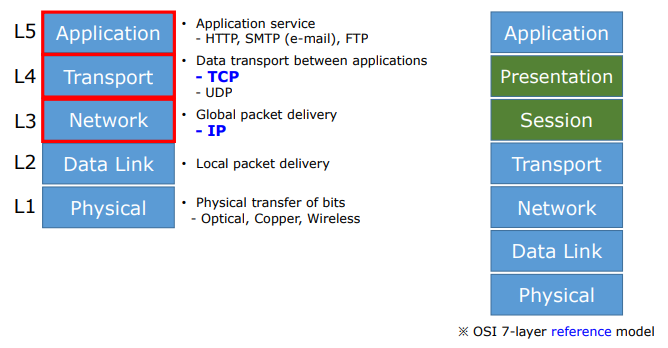
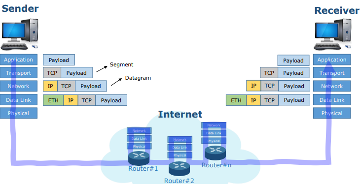
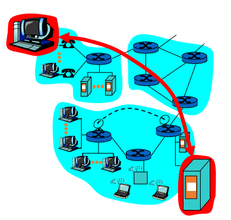
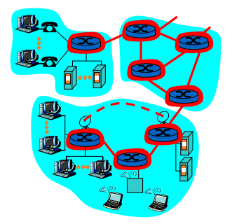
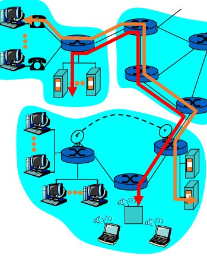
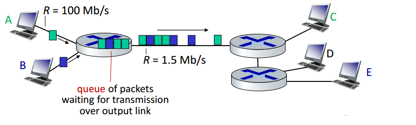
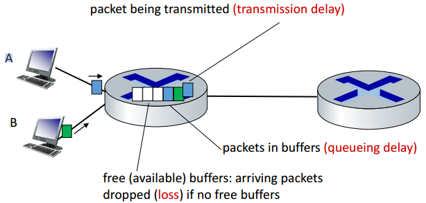
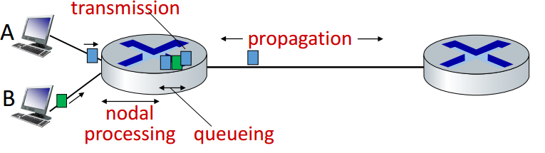

# Background
#Computer Network/Backgorund

---

## TCP/IP Protocol Model (Stack or Suite)

## Typical Communication Path

## Network Structure
- Network edge:
    - Applicaions and hosts
- Network core:
    - Routers
- Access networks, physical media:
    - Communication links

## The Network Edge

- End Systmes (hosts):
    - Run application programs
    - e.g. Web, email
- client/server model
    - Cllient host requests, receives service from always-on server
    - e.g. Web browser/server; email client/server

## Internet Services Models
- Connection-oriented Service
- Connectionless service

### Connection-Oriented Service
- TCP - Transmission Controll Protocol
    - Internet's connection-oriented service
    - Reliable, in-order byte-stream data transfer
    - Flow control:
        - sender won't overwhelm receiver
    - Congestion control
        - senders "slow down sending rate" when network congested

### Connectionless Service
- UDP - User Datagram Protocol
    - Connectionless
    - Unreliable data tranfer
    - No flow control
    - No congestion control

## Network Core
- Mesh of interconnected routers
- How is data transferred through net?
    - Circuit switching
    - Packet switching

### Circuit Switching
- End-end resources reserved for "call
- Dedicated resources: no sharing
- Circuit-like (guaranteed) performance
- Call setup required
- Must divide link bandwidth into pieces

### Packet Switching
- packets share network resources
- Aggregate resource demand can exceed amount available

## Packet Switching VS Circuitt Switching
- 1 Mbs link
- Each user:
    - 100 kb/s when "active"
    - Active 10% of time
- Circuit-switching:
    - 10 users
    - Guaranteed behavior
- Packet switching:
    - more users than 10, probabiity > 10 active less than 0.0004
    - Resource sharing
    - Simpler, no call setup
    - Excessive congestion possible: packet delay and loss

## How Do Packet Delay and Loss Occur?

- Packets queue in router buffers, waiting for turn for transmission
- Packet loss occurs  when memory to hold queued packets fill up

## Packet Delay: Four Sources

1. Nodal processing delay:
    - Check bit errors
    - Determine output link
2. Queueing delay
    - Time waiting at output link for transmission
    - Depends on congestion level of router
3. Transmission delay
    - R = link bandwidth (bps)
    - L = packet length (bits)
    - time to send bits into link = L/R
4. Propagation delay
    -  d = length of physical link
    -  s = propagation speed
    - propagation delay = d/s

1,3 번은 돈주고 좋은 기계로 바꾸면 개선가능하고, 2, 4번은 힘듬

## IP: Internet Protocol
- Global delivery of packet through routers in networks
    - IP Addressing: globally unique address for each routable device
- IP routing
    - Network-wide process determining "good" end-to-end path