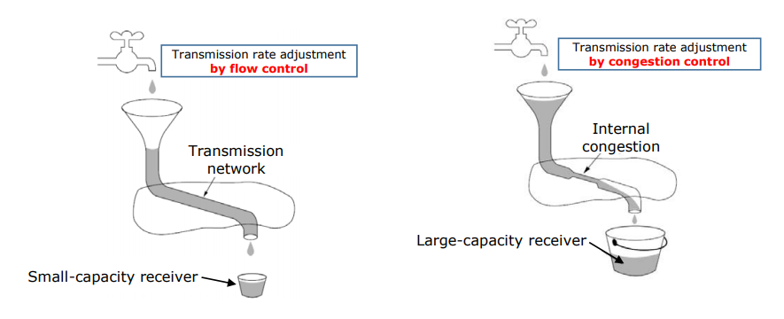
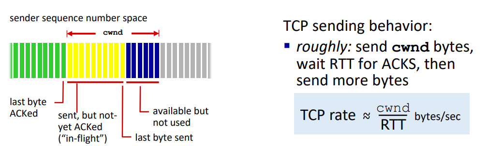
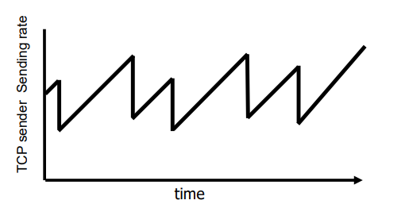
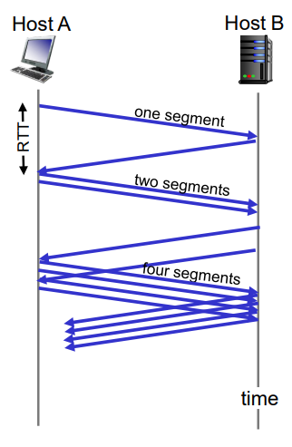
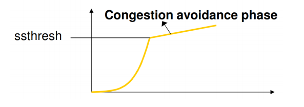
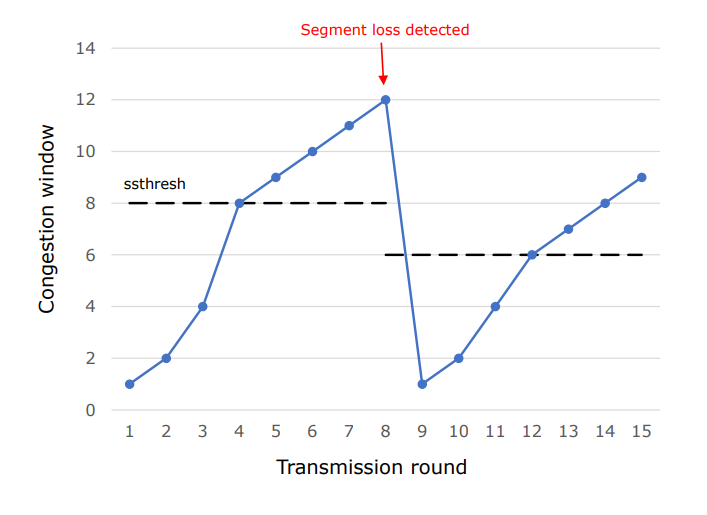

# Congestion Control
#Computer Network/Congestion Control

## Flow Control vs Congestion Control
- Flow Control: adjusting sending rate based on receiver's capabilities
- Congestion Control: adjusting sending rate based on network's capabilities    

## TCP Congestion Control: Overview

- TCP Sender limits transmission: LastByteSent - LastByteAcked <= cwnd
- cwnd is dynamcially adjusted in response to observed network congestion (implementing TCP congestion control)
- Basic approach: senders can increase sending rate unitl packet loss(congestion) occurs, then decrease sending rate on loss event
    
- Three phases in congestion control
    - Slow start (not really slow)
        - Sender starts at a slow rate but increase sending rate "exponentially" until first loss
            - When it reaches ssthresh(slow start threshold), congestion avoidance starts
    - Congestion avoidance
        - Sender increases sending rate "linearly"
            - When segment loss occurs, slow start "or" fastrecovery starts
    - Fast recovery (optional)

## Slow Start

- When connection begins, increase rate exponentially
    - initially cwnd = 1 MSS
    - Double cwnd every RTT
    
    -> Done by incrementing cwnd by 1 MSS for the received ACK
- Summary
    - Initial rate is slow, but ramps up exponentially fast
- When segement loss is detected
    - ssthresh <- cwnd/2
    - cwnd <- 1 MSS
- When cwnd reaches ssthresh
    - Congestion avoidance starts

## Congestion Avoidance

- When cwnd reach ssthresh, congestion avoidance starts
    - cwnd grows linearly
    - cwnd = cwnd + 1 MSS every RTT

    -> Done by incrementing cwnd by 1/cwnd MSS for received ACK
- When segment loss is detected
    - ssthresh <- cwnd/2
    - cwnd <- 1 MSS
    - Do slow start phase again

## From Slow Start to Congestion Avoidance

## Not All Losses the Same
- Three duplicate ACks
    - Still getting ACKs
- Timeout
    - Much more serious
    - Heavy congestion