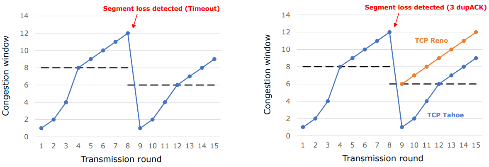
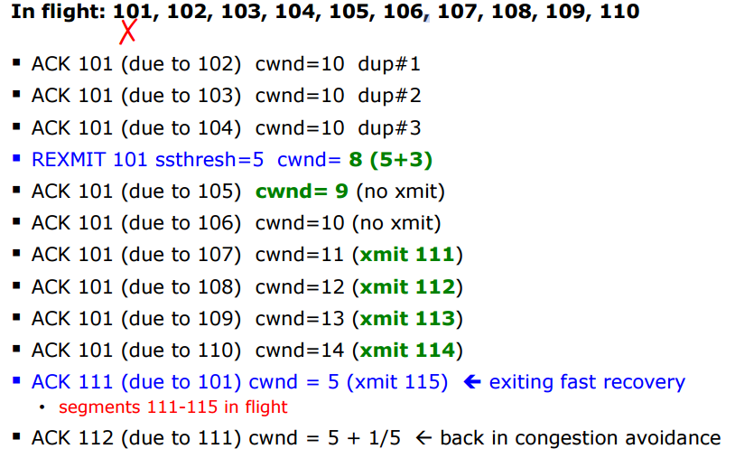
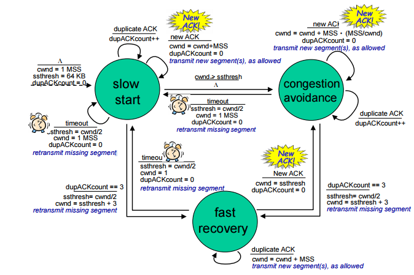

# Congestion Control
#Computer Network/Congestion Control

## Flow Control vs Congestion Control
- Flow Control: adjusting sending rate based on receiver's capabilities
- Congestion Control: adjusting sending rate based on network's capabilities    

## TCP Congestion Control: Overview

- TCP Sender limits transmission: LastByteSent - LastByteAcked <= cwnd
- cwnd is dynamcially adjusted in response to observed network congestion (implementing TCP congestion control)
- Basic approach: senders can increase sending rate unitl packet loss(congestion) occurs, then decrease sending rate on loss event
    
- Three phases in congestion control
    - Slow start (not really slow)
        - Sender starts at a slow rate but increase sending rate "exponentially" until first loss
            - When it reaches ssthresh(slow start threshold), congestion avoidance starts
    - Congestion avoidance
        - Sender increases sending rate "linearly"
            - When segment loss occurs, slow start "or" fastrecovery starts
    - Fast recovery (optional)

## Slow Start

- When connection begins, increase rate exponentially
    - initially cwnd = 1 MSS
    - Double cwnd every RTT
    
    -> Done by incrementing cwnd by 1 MSS for the received ACK
- Summary
    - Initial rate is slow, but ramps up exponentially fast
- When segement loss is detected
    - ssthresh <- cwnd/2
    - cwnd <- 1 MSS
- When cwnd reaches ssthresh
    - Congestion avoidance starts

## Congestion Avoidance

- When cwnd reach ssthresh, congestion avoidance starts
    - cwnd grows linearly
    - cwnd = cwnd + 1 MSS every RTT

    -> Done by incrementing cwnd by 1/cwnd MSS for received ACK
- When segment loss is detected
    - ssthresh <- cwnd/2
    - cwnd <- 1 MSS
    - Do slow start phase again

## From Slow Start to Congestion Avoidance

## Not All Losses the Same
- Three duplicate ACks
    - Still getting ACKs
- Timeout
    - Much more serious
    - Heavy congestion
- After timeout event:
    - ssthresh -> cwnd/2
    - cwnd -> 1 MSS
    - Do slow start phase again
- But, after 3 dup ACKs: enter Fast-recovery
    - ssthresh -> cwnd/2 (same)
    - cwnd is set to ssthresh
    - cwnd then grows linearly (like congestion avoidance phase)

## Evolution of TCP's Congestion Flow

- TCP Tahoe does not adopt Fast-recovery

## Summary: TCP Congestion Control
- When cwnd is below, sender in slow start phase, window grows exponentially
- When cwnd is above ssthresh, sender enters congestion-avodiance phase, cwnd grows linearly
- When a triple duplicate ACk occurs, ssthresh set to cwnd/2 and cwnd set to ssthresh
- When timeout occurs , ssthresh set to cwnd/2 and cwnd is set to 1 MSS

## Fast Recovery in Detail
Idea: Grant the sender temporary "credit" for each dupACk so as to keep segment in flight

- If dupACKcount = 3
    - ssthresh = cwnd/2
    - cwnd = ssthresh + 3

- While in fast recovery
    - cwnd = cwnd + 1 for each additional duplicate ACk 
- Exit fast recovery after receiving new ACK
    - set cwnd = ssthresh

## Example
- Consider a TCP connection with:
    - CWND=10 segments
    - Last ACK was for packet # 101
- 10 segments [101, 102, 103, ..., 110] are in flight
    - segments 101 is dropped
    - What ACKs do they generate?
    - And how does the sender respond?

## Time Line (at Sender)

## Finite-State Machine of TCP Congestion Control

