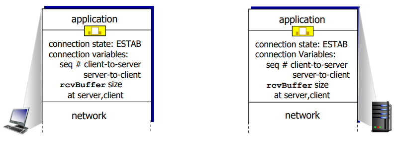
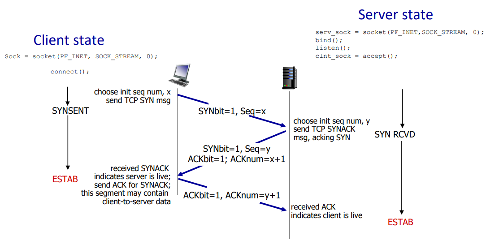
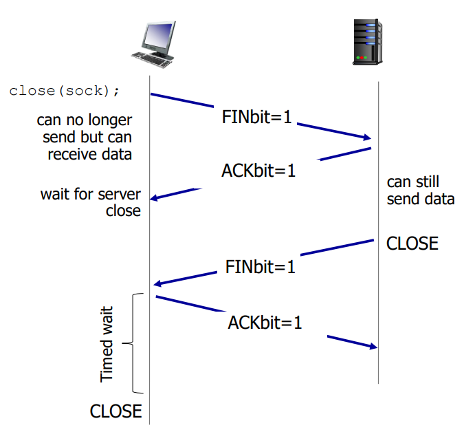

# Connection Management and Flow Control
#Computer Network/Connection Management and Flow Control

---

## TCP Connection Management
Before exchanging data, sender/receiver "handshake":
- Agree to establish connection(each knowing the other willing to establish connection)
- Inform connection parameters(e.g., starting seq #s)

## TCP 3-way Handshake

## Closing Connection

