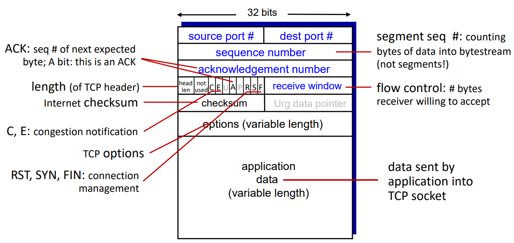
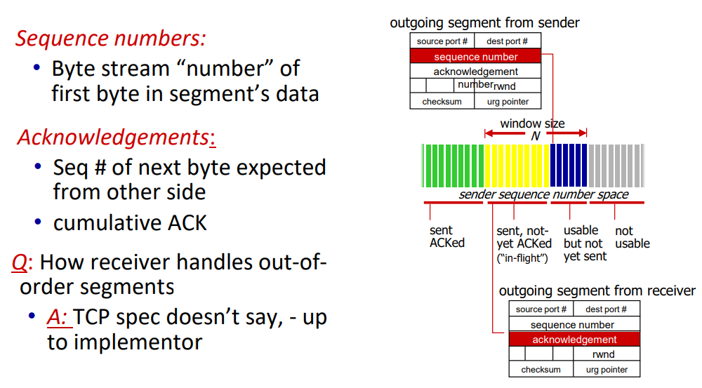
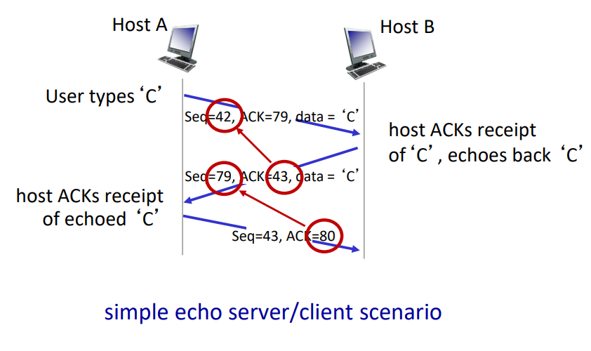
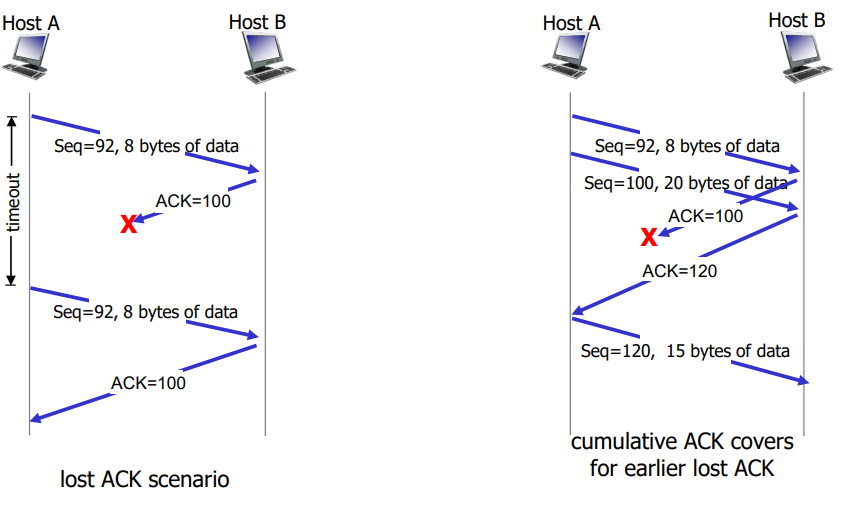
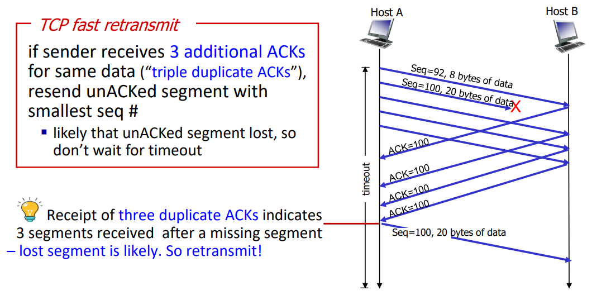

# Connection-oriented transport: TCP
#Computer Network/Connection-oriented transport: TCP

---

## TCP: Overview
- Point-to-point:
    - One Sender, one receiver
- Reliable, in-order byte stream:
    - No "message boundaries"
- Full duplex data:
    - Bi-directional data flow in same connection
    - MSS: maximum segment size
- Cumultavie ACKs
- Pipelining:
    - TCP congestion and flow control set window size
- Connection-oriented
    - Handshaking(exchange of control messages) initializes sender, receiver state before data exchange
- Flow control
- Congestion control

## TCP Segment Structure

## TCP Sequence Numbers, ACKs

## TCP Sender
- event: data received from application
    - create segment with seq #
    - seq # is byte-stream number of first data byte in segment
    - start timer if not already running
        - think of timer as for oldest unACKed segment
- event: timeout
    - retransmit segment that caused timeout
    - restart timer
- event: ACK received
    - if ACK acknowledges previously unACKed segments
        - update what is known to be ACKed
        - start timer if there are still unACKed segments

### TCP: Retransmission Scenarios

## TCP Fast Retransmit

