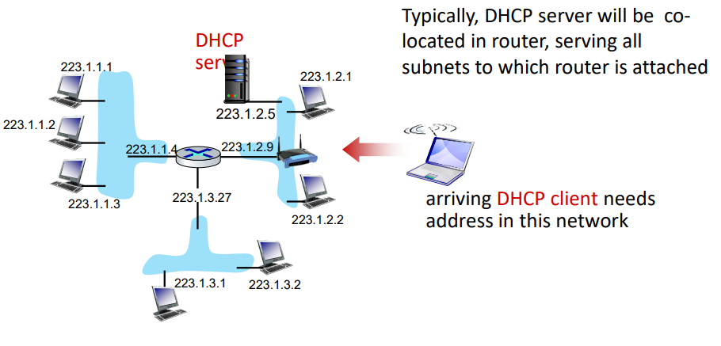
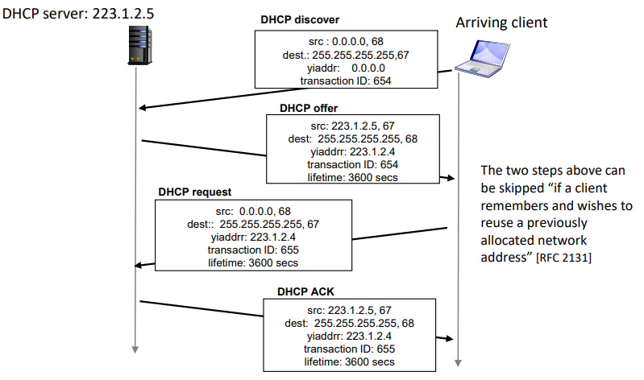
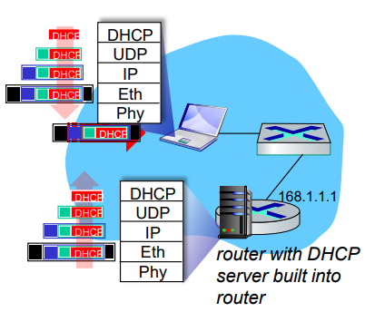
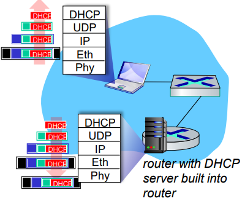

# DHCP
#Computer Network/DHCP

---

## IP Addresses: How To Get One?
How does host get IP address?
- DHCP: Dynamic Host Configuration Protocol: dynamically get address from as server
    - "plug-and-play"

## DHCP: Dynamic Host Configuration Protocol
goal: host dynamically obtains IP address from network server when it "joins" network
- can renew its lease on address in use
- allows reuse of address (only hold address while connected/on)
- support for mobile users who join/leave network

DHCP overview:
- host broadcast DHCP discover msg [optional]
- DHP server responds with DHCP offer msg [optional]
- host requests IP address: DHCP request msg
- DHCP server sends address: DHCP ack msg

## DHCP Client-Server Scenario

## DHCP: More Than IP Addresses
DHCP can return more than just allocated IP address on subnet:
- address of first-hop router for client
- name and IP address of DNS server
- network mask (indicating network versus host portion of address)

## DHCP: Example

- Connecting laptop will use DHCP to get IP address, address of first-hop router, address of DNS server.
- DHCP REQUEST message encapsulated in UDP, encapsulated in IP, encapsulated in Ethernet.
- Ethernet frame broadcast(dest:FFFFFFFFFFFF) on LAN, received at router running DHCP server

- DHCP server formulates DHCP ACK containing client's IP address, IP address of first-hop router for client, name & IP address of DNS server
- encapsulated DHCP server reply forwarded to client, demuxing up to DHCP at client
- client now knows its IP address, name and IP address of DNS server , IP address of its first-hop router

---
Q: how does network get subnet part of IP address?

A: gets allocated portion of its provider ISP's address space
- ISP's block 11001000 00010111 00010000 00000000 200.23.16.0/20