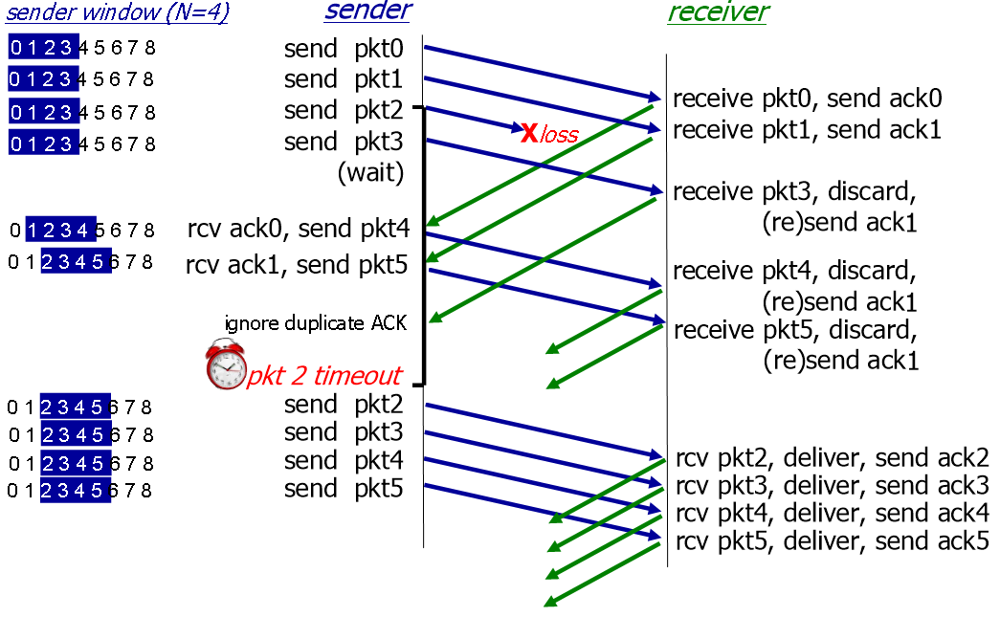

# Go Back N and Selective Repeat
#Computer Network/Go Back N and Selective Repeat

---

## Performance of rdt3.0 (stop-and-wait)

1개 패킷 보내고 RTT가 너무 길다. (효율이 안 좋음)

## Pipelined Protocols Operation
Pipelining: sender allows multiple, "in-flight", yet-to-be-acknowledged packets
- Range of sequence numbers must be increased
- Buffering at sender and/or receiver

## Go-Back-N: Sender
- Sender: "window" of up to N, consecutive transmitted but unACKed pkts
    - K-bit seq # in pkt header
    
    
- Cumulative ACK: ACK(n): ACKs all packets up to, including seq # n
    - On receiving ACK(n): move window forward to begin at n+1
    - Timer for oldest in-flight packet
    - Timeout(n): retransmit packet n and all higher seq # packets in window

## Go-Back-N: Receiver
- ACK-only: always send ACk for correctly-received packet so far, with highest in-order seq #
    - May generate duplicate ACKs
    - Need only remember rcv_base
- On receipt of out-of-order packet:
    - Can discard (don't buffer) or buffer: an implementation decision
- Re-ACk pkt with highest in-order seq #

## Go-Back-N in Action

## Selective Repeat
- Receiver individually acknowledges all correctly received packets
    - Buffers pacckets, as needed, for eventual in-order delivery to upper layer
- Sender times-out/retransmits individually for unACKed packets
    - Sender maintains timer for each unACKed pkt

## Selective Repeat: Sender, receiver windows

sender
- data from above:
    - if next available seq # in window, send packet
- timeout(n):
    - resend packet n, restart timer
- ACK(n) in [sendbase, sendbase + N]:
    - mark packet n as received
    - if n smallest unACKed packet, advance window base to next unACKed seq #

receiver
- packet n in [rcvbase, rcvbase + N - 1]
    - send ACK(n)
    - out-of-order: buffer
    - in-order: deliver (also deliver buffered, in-order packets), advance window to next not-yet-received packet
- packet n in [rcvbase-N, rcvbase-1]:
    - ACK(n)
- otherwise:
    - igonre

## Selective Repeat in Action

