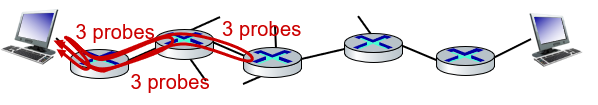

# ICMP & Tunneling
##Computer Network/ICMP & Tunneling

--- 

## ICMP: Internet Control Message Protocol
- Used by hosts and routers to communicate network-level information
    - error reporting: unreachable host, network, port, protocl
    - echo request/reply (used by ping)
- ICMP message: type, code plus first 8 bytes of IP datagram causing error

## Traceroute & ICMP

- source sends sets of UDP segments to destination
    - 1st set has TTL = 1, 2nd set has TTL = 2, etc.
- datagram in nth set arrives to nth router:
    - router discards datagram and sens source ICMP message(type 11, code 0)
    - ICMP message possibly includes name of router & IP address
- When ICMP message arrives at source: record RTTs

## Transition From IPv4 to IPv6
- Not all routers can be upgraded simultaneously
    - no "flag days"
    - how will network operate with mixed IPv4 and IPv6 routers?
- Tunneling: IPv6 datagram carried as payload in IPv4 datagram among IPv4 routers
    - tunneling used extensively in other contexts (4G/5G)
    