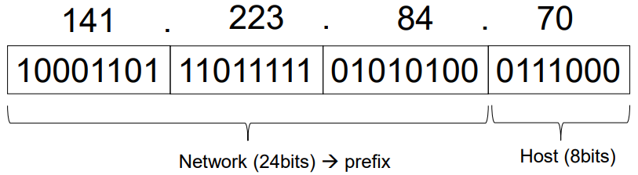
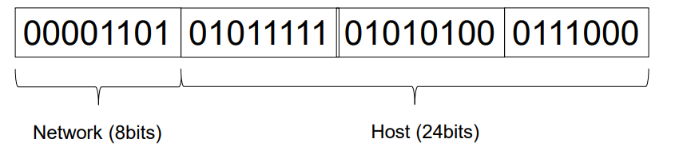
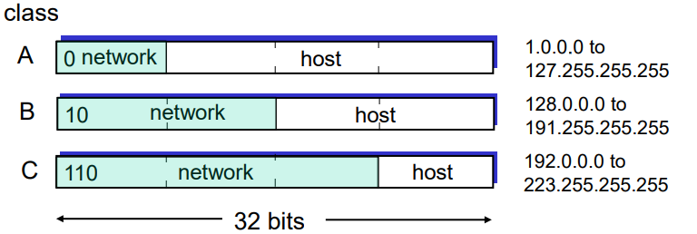
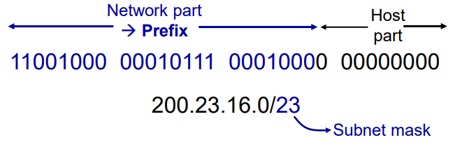
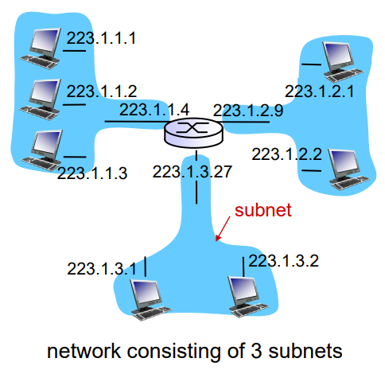
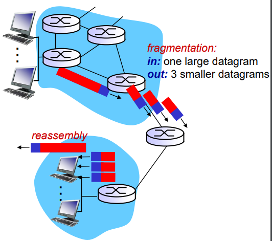
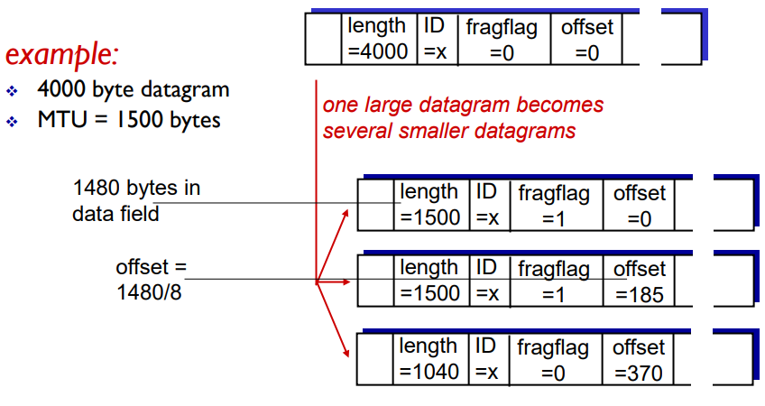
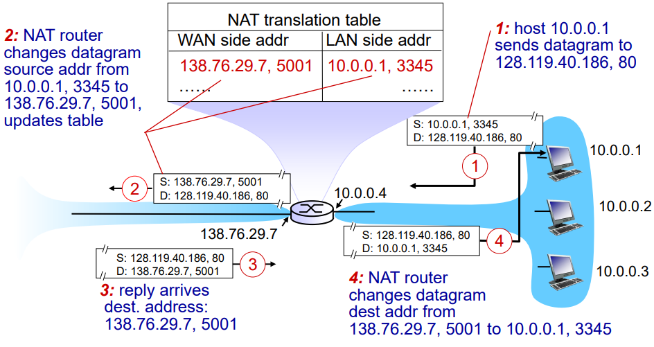

# Network Layer
#Computer Network/Network Layer

---

## Layering
Layers
- A part of a system with well-defined interfaces to other parts
- One layer interacts only with layer above and layer below
- Two layers interact only through the interface between them

## Why Layering?
- Reduce complexity
- Improve flexibility
- But
    - Sub-optimal performance
    - Cross-layer information often useful
    - Several "layer violations" in practice

## Network Layer
- Transport segment from sending to receving host
- On sending side encapsulates segments into datagrams
- On receving side, delivers segments to transport layer
- Network layer protocols in every host, router
- Router examines header fields in all IP datagrams passing through it

## Two Key Network Layer Functions
- Forwarindg: move packets from routers input to appropriate router output
- Routing: determine route taken by packets from source to dest.
    - routing algorithms

## Interplay Between Routing and Forwarding

### Longest Prefix Matching
When looking for forwarding table entry for given destination address, use longest address prefix that matches destination address.

## Per Router Control Plane
Individual routing algorithm components in each and every router interact in the control plane

## IP datagram format

- TTL 있는 이유: 무한 루프를 막기 위해
- upper layer - 위 transparent layer에서 tcp, udp 중 선택

## IP Addreess (IPv4)
- Unique 32bits numbers
- Identifies a network interface
- Hierarchical Addressing
    - Network and host parts

- Always dotted-decimal notation
- Always network/host address split
- But nature of that split has changed over time

## IP Address: Original Internet Addressing

Assumed 256 networks were more than enough

## IP Addressing: Classful Addressing (1981)

Problem: networks only come in three sizes

## IP Addressing: CIDR (1993)
CIDR: Classless Inter-Domain Routing
- Subnet portion of address(prefix) of arbitrary length
- Address format: a.b.c.d/x, where x is # bits in subnet portion of address

### Classful vs Classless Addressing
- 애매한경우 Classful 같은 경우 많이 낭비되거나, 그렇다고 작은거를 부여하기에 부족함.
- Classless는 최대한 비슷하게 나눠줄 수 있음

## Subnets

- IP address:
    - Subnet part (prefix) - high order bits
    - Host part - low order bits
- What's a subnet?
    - Device interfaces with same subnet of IP address
    - Can physically reach each other without intervening router

## IP Fragmentation & Reassembly

- Network links have MTU(max.transfer size) - largest possible link-level frame
    - different link types, different MTUs
- Large IP datagram divided("fragmented") within net
    - One datagram becomes several datagrams
    - "Reassembled" only at final destination
    - IP header bits used to identify, order related fragments

- IP header(20byte) 때문에 길이가 1500이라도 실제 데이터는 1480이 담김
- 마지막 fragflag = 0
- offset = 실제offset/8

## NAT: Network Address Translation

- Implemntation: NAT router must:
    - Outgoing datagrams: replace (Source IP address, port #) of every outgoing datagram to (NAT IP address, new port #) ... remote clients/servers will respond using (NAT IP address, new port #) as destination addr
    - Remember ( in NAT translation table) every (source IP address port #) to (NAT IP address, new port #) translation pair
    - Incoming datagrams: replace (NAT IP address, new port #) in des fields of every incoming datagram with corresponding (source IP address, port #) stored in NAT table