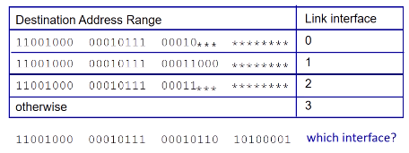

# Network Layer
#Computer Network/Network Layer

---

## Layering
Layers
- A part of a system with well-defined interfaces to other parts
- One layer interacts only with layer above and layer below
- Two layers interact only through the interface between them

## Why Layering?
- Reduce complexity
- Improve flexibility
- But
    - Sub-optimal performance
    - Cross-layer information often useful
    - Several "layer violations" in practice

## Network Layer
- Transport segment from sending to receving host
- On sending side encapsulates segments into datagrams
- On receving side, delivers segments to transport layer
- Network layer protocols in every host, router
- Router examines header fields in all IP datagrams passing through it

## Two Key Network Layer Functions
- Forwarindg: move packets from routers input to appropriate router output
- Routing: determine route taken by packets from source to dest.
    - routing algorithms

## Interplay Between Routing and Forwarding

### Longest Prefix Matching
When looking for forwarding table entry for given destination address, use longest address prefix that matches destination address.

## Per Router Control Plane
Individual routing algorithm components in each and every router interact in the control plane

## IP datagram format

- TTL 있는 이유: 무한 루프를 막기 위해
- upper layer - 위 transparent layer에서 tcp, udp 중 선택