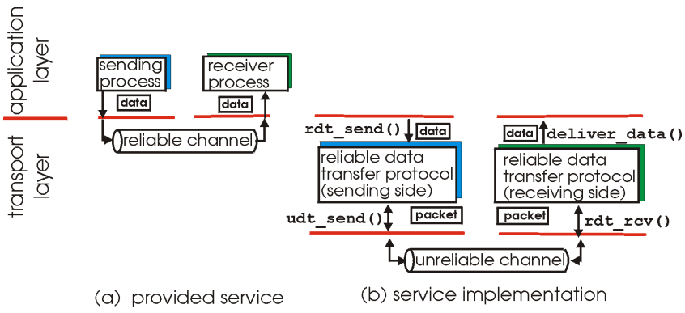
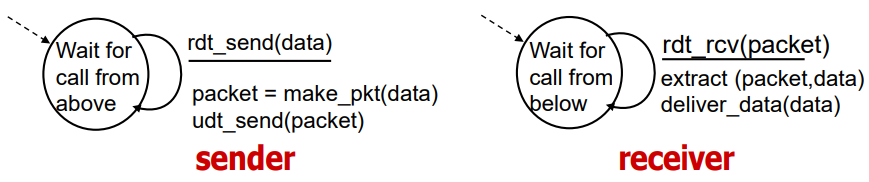
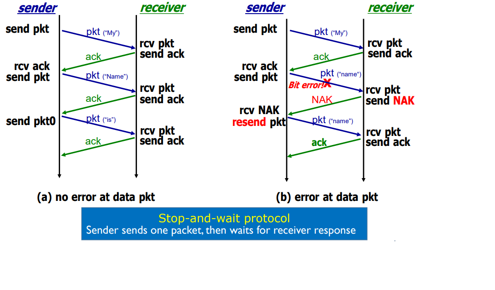
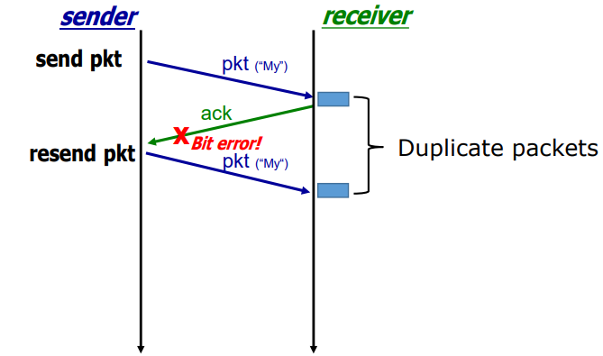
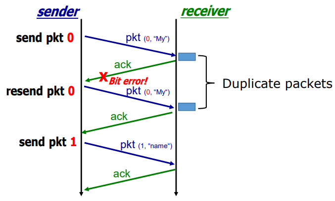
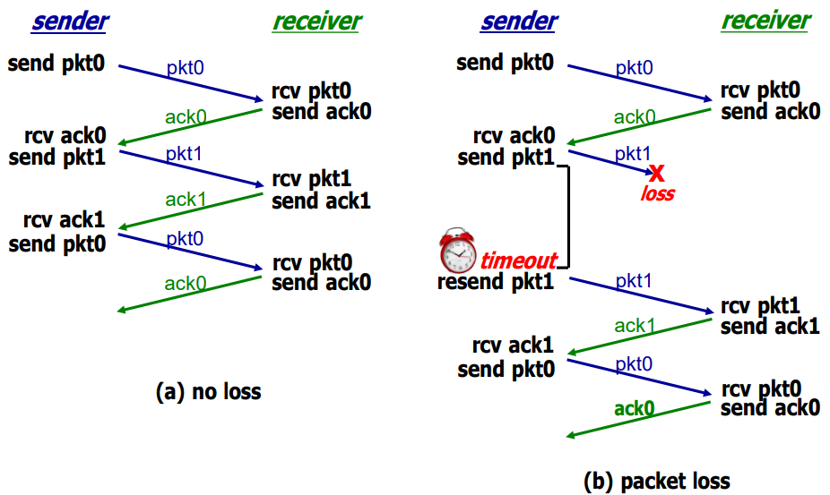
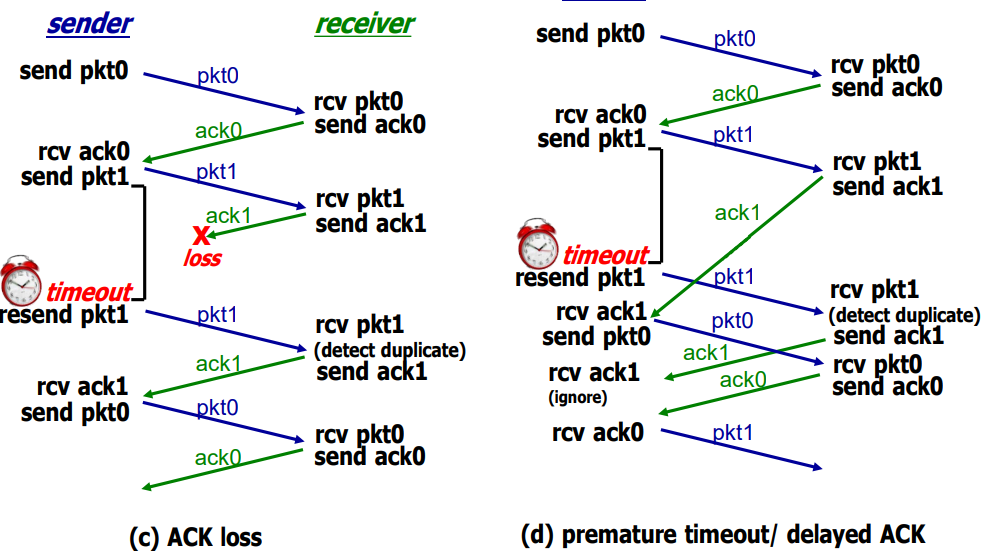

# Principles of Reliable Data Transfer
#Computer Network/Principles of Reliable Data Transfer

---

## Principles of Reliable Data Transfer
Important in apllication, transport, link layers

## rdt1.0: Reliable Transfer over Reliable Channel
- Underlying channel perfectly reliable
    - No bit errors
    - No loss of packets
- Sender sends data into underlying channel
- Recevier reads data from underlying channel

## rdt2.0: Channel with Bit Errors (no loss!)
- What mechanism do we need to deal with error?
    - Error detection
        - Add checksum field
    - Receiver Feedback
        - Acknowledgements (ACKs): receiver explicitly tells sender that pkt received OK
        - Negative acknowledgements (NAKs): receiver explicitly tells sender that pkt had errors
        - Retransmission
            - Sender retransmits packet on receipt of NAK

=> Error detection, Feedback (from receiver), Retransmission

- What happens if ACK or NAk has errors?
    - Possible solution: sender simply resends the current packet

Handling Duplicate Packets
- Receiver discards duplicate packet
- However, receiver don't know whether sender wants to send pkt containg "My" twice(new packet) or it is simply resent pkt (duplicate pkt)

## rdt2.1: Introducing Sequence Number
- Sender adds sequence number to each packet
- sender retransmit current packet with same sequence number when receive garbled ACK/NAK
- Receiver discards duplicate packet

Example

## rdt2.2: NAK-free Version
- Instead of NAK, receiver sends ACK for last correct received packet
    - Receiver must explicitly include seq # of packet being ACKed
- Duplicated ACK at sender results in same action as NAK

## rdt 3.0: Lossy Channel With Bit Error
- New assumption
    - Underlying channel can also lose packets (data/ACK)
- Checksum, seq. #, ACKs, retransmissions will be of help ...
    - but not enough
- What mechanisms do we need for packet loss?
    - Timer
- Sender waits "reasonable" amount of time for ACK (a Time-out)
- If packet (or ACK) is just delayed (not lost):
    - Retransmission will be duplicate
    - But use of seq.# already handles this issue (rdt2.1)

## rdt3.0 In Action

## Summary: Principle of Reliable Data Transfer
- What can happen over unreliable channel?
    - Packet error and Pakcet loss
- What mechanisms for packet error?
    - Error detection, feedback, retransmission, sequence number
- What mechanism for packet loss?
    - Timer

> Real-world protocol(e.g., TCP) is more complex, but with same principle