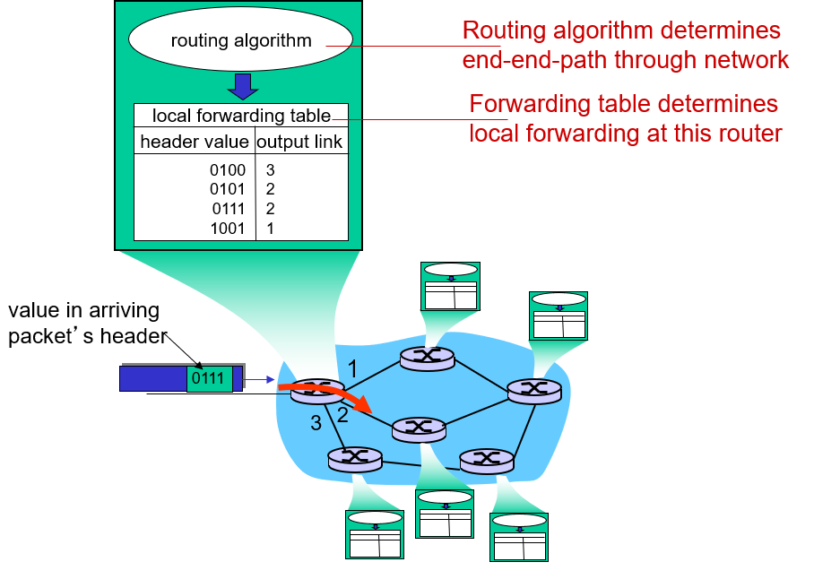
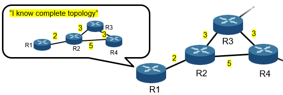
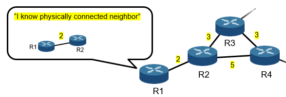
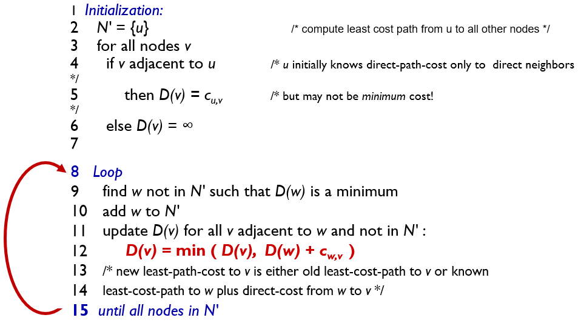
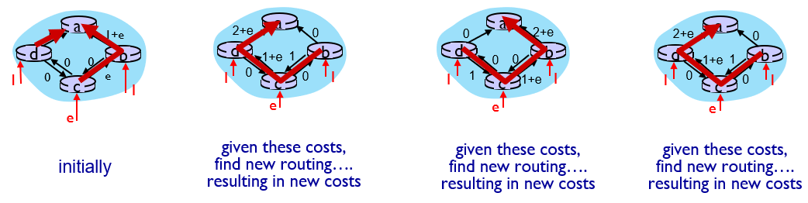
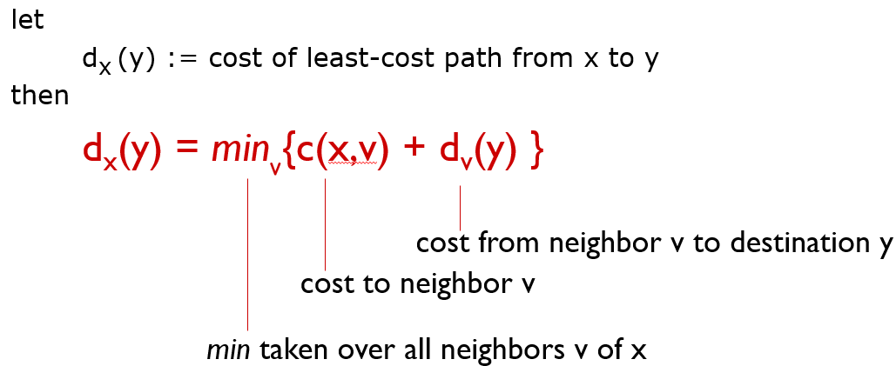

# Routing Algorithms
##Computer Network/Routing Algorithms

---
##  Interplay Between Routing and Forwarding

## Routing Protocols
Routing protocol goal: determine "good" paths from sending hosts to receiving host, through network of routers
- path: sequence of routers packets traverse from given initial source host to final destination host
- "good": least "cost", "fastest", "least congested"

## Routing Algorithms

- Link-state algorithm
    - Based on dijkstra's algorithm
    
- Distance-vector algorithm
    - Based on bellman-ford equation
     

## Dijkstra's link-state routing algorithm

## Dijkstra's algorithm: oscillations possible
- When link costs depend on traffic volume, route oscillations possible

## Distance Vector Algorithm
Bellman-Ford equation

