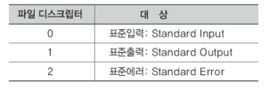
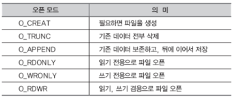
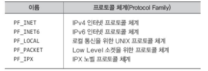
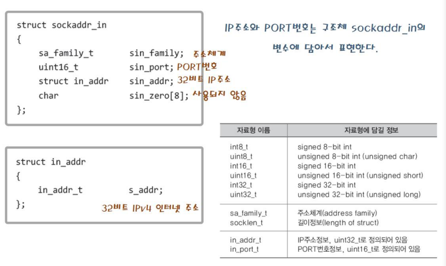
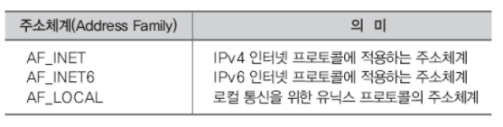

# Socket() and Bind()
#Computer Network/ Socket() and Bind()

---
## Low Level I/O and File Descriptor
저 수준 파일 입출력
- ANSI의 표준함수가 아닌, 운영체제가 제공하는 함수 기반의 파일 입출력.
- 표준이 아니기 떄문에 운영체제에 대한 호환성이 없다. 
- 리눅스는 소켓도 파일로 간주하기 때문에 저 수준 파일 입출력 함수를 기반으로 소켓 기반의 데이터 송수신이 가능하다.

파일 디스크립터
- 운영체제가 만든 파일(그리고 소켓)을 구분하기 위한 일종의 숫자
- 저 수준 파일 입출력 함수는 입출력을 목적으로 파일 디스크립터를 요구한다.
- 저 수준 파일 입출력 함수에게 소켓의 파일 디스크립터를 전달하면, 소켓을 대상으로 입출력을 진행한다.



## File Open & Close

```c
#include <sys/types.h>
#include <sys/stat.h>
#include <fctn1.h>

int open(const char *path, int flag);
// -> 성공시 파일 디스크립터, 실패시 -1 반환
// open 함수 호출 시 반환된 파일 디스크립터를 이용해서 파일 입출력을 진행하게 된다.
```
- path: 파일 이름을 나타내는 문자열의 주소 값 전달
- flag: 파일의 오픈 모드 정보 전달



```c
#include <unistd.h>

int close(int fd);
// 성공 시 0, 실패 시 -1 반환
```
- fd: 닫고자 하는 파일 또는 소켓의 파일 디스크립터 전달

## Write Data to File

```c
#include <unistd.h>

ssize_t write(int fd, const void * buf, size_t nbytes);
// 성공 시 전달한 바이트 수, 실패 시 -1 반환
```
- fd: 데이터 전송대상을 나타내는 파일 디스크립터 전달
- buf: 전송할 데이터가 저장된 버퍼의 주소 값 전달.
- nbytes: 전송할 데이터의 바이트 수 전달

## Read Data From File 

```c
#include <unistd.h>

ssize_t read(int fd, void *buf, size_t nbytes);
// 성공 시 수신한 바이트 수(단 파일의 끝을 만나면 0), 실패시 -1 반환
```
- fd: 데이터 수신대상을 나타내는 파일 디스크립터 전달.
- buf: 수신한 데이터를 저장할 버퍼의 주소 값 전달
- nbytes: 수신할 최대 바이트 수 전달

## "Protocol Family" for socket()
```c
#include <sys/socket.h>

int socket(int domain, int type, int protocol);
// 성공 시 파일 디스크립터, 실패 시 -1 반환
```
- domain: 소켓이 사용할 프로톨 체계(Protocol Family) 정보 전달.
- type: 소켓의 데이터 전송방식에 대한 정보 전달.
- protocol: 두 컴퓨터간 통신에 사용되는 프로토콜 정보 전달



## "Socket Type" for socket()
```c
// IPv4 인터넷 프로토콜 체계에서 동작하는 연결지향형 데이터 전송 소켓

int tcp_socket= socket(PF_INET, SOCK_STREAM, IPPROTO_TCP);
//TCP 소켓
```

```c
// IPv4 인터넷 프로토콜 체계에서 동작하는 비 연결지향형 데이터 전송 소켓

int tcp_socket= socket(PF_INET, SOCK_DGRAM, IPPROTO_UDP);
//UDP 소켓
```
첫 번째, 두번째 인자로 전달된 정보를 통해서 소켓의 프로토콜이 사실상 결정되기 때문에 세 번째 인자로 0을 전달해도 된다!

## bind()

```c
#include <sys/socket.h>

int bind(int sockfd, struct sockaddr *my addr);
// -> 성공 시 0, 실패 시 -1 반환
```
- sockfd: 주소정보를(IP와 PORT를) 할당할 소켓의 파일 디스크립터.
- myaddr 할당하고자 하는 주소정보를 지니는 구조체 변수의 주소 값.
- addrlen 두 번째 인자로 전달된 구조체 변수의 길이정보.

## Port Number
- Ip는 컴퓨터를 구분하는 용도로 사용되며, PORT번호는 소켓을 구분하는 용도로 사용된다.
- 하나의 프로그램 내에서는 둘 이상의 소켓이 존재할 수 있으므로, 둘 이상의 PORT가 하나의 프로그램에 의해 할당될 수 있다.
- PORT 번호는 16비트로 표현, 따라서 그 값은 0 이상 65535 이하
- 0 ~ 1023은 잘 알려진 PORT(Well-knwon PORT)라 해서 이미 용도가 결정되어 있다.

## Structure for IPv4 Address



- 멤버 sin_family
    - 주소체계 정보 저장



- 멤버 sin_port
    - 16비트 PORT번호 저장
    - 네트워크 바이트 순서로 저장
- 멤버 sin_addr
    - 32비트 IP주소정보 저장
    - 네트워크 바이트 순서로 저장
    - 멤버 sin_addr의 구조체 자료형 in_addr 사실상 32비트 정수자료형
- 멤버 sin_zero
    - 특별한 의미를 지니지 않는 멤버
    - 반드시 0으로 채워야 한다.

```c
struct sockaddr_in serv_addr;
....
if(bind(serv_sock, (struct sockaddr*) &serv_addr, sizeof(serv_addr)) == -1))
    error_handling("bind() error");
....
```
- 구조체 변수 sockaddr_in은 bind 함수의 인자로 전달되는데, 매개변수 형이 sockaddr이므로 형 변환을 해야만 한다.

```c
struct sockaddr
{
    sa_family_t sin_family; //주소체계
    char sa_data[14]    //주소 정보
}
- 구조체 sockaddr은 다양한 주소체계의 주소정보를 담을 수 있도록 정의되었다. 그래서 IPv4의 주소정보를 담기가 불편하다. 이에 sockaddr_in이 정의되었음.
```

## Host Byte Order vs. Network Byte Order

- 빅 엔디안(Big Endian)
    - 상위 바이트의 값을 작은 번지수에 저장
- 리틀 엔디안(Little Endian)
    - 상위 바이트의 값을 큰 번지수에 저장
- 호스트 바이트 순서
    - CPU별 데이터 저장방식을 의미함
- 네트워크 바이트 순서
    - 통일된 데이터 송수신 기준을 의미함
    - 빅엔디안이 기준
    