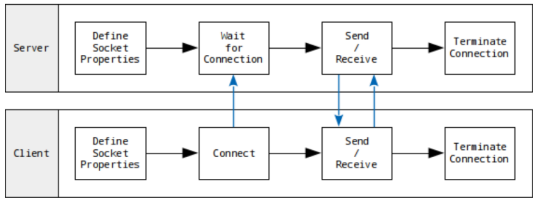

# Socket_Basic
#Computer Network/Socket_Basic

---

## Network Programming (Socket Programming)

- Programming for communicatoins among computers
- Socket
    - Process sends/receives messages to/from its socket
    - Socket analogous to door
        - Sending process shoves message out door
    - Two sockets involved: one on each sidez


## Communication between Server & Client



## Important Functions at Server Side

Define server socket
```c
#include <sys/socket.h>
int socket(int domain, int type, int protocol);
// -> 성공시 파일 디스크립터, 실패 시 - 1 반환
```

Binding (assign IP address and port # to the socket)
```c
#include <sys/socket.h>
int bind(int sockfd, struct sockaddr *myaddr, socklen_t addrlen);
// -> 성공 시 0, 실패 시 -1 반환
```

Waiting for connection request from client
```c
int listen(int sockfd, int backlog);
// -> 성공 시 0, 실패 시 -1 반환
```

```c
#include <sys/socket.h>
int accept(int sockfd, struct sockaddr *addr, socklen_t *addrlen);
// -> 성공 시 파일 디스크립터, 실패 시 -1 반환
```

## Function Flow at Server Side


## Important Functions at Client
Define socket
(This function is used in both server and client sides)

```c
#include <sys/socket.h>
int socket(int domain, int type, int protocol);
//-> 성공 시 파일 디스크립터, 실패 시 -1 반환
```

Request Connection to Server
```c
#include <sys/socket.h>
int connect(int sockfd, struct sockaddr *serv_addr, socklen_t addrlen));
//-> 성공 시 0, 실패 시 -1 반환
```

## Function Flow at Client Side


## Interaction Between Server & Client

