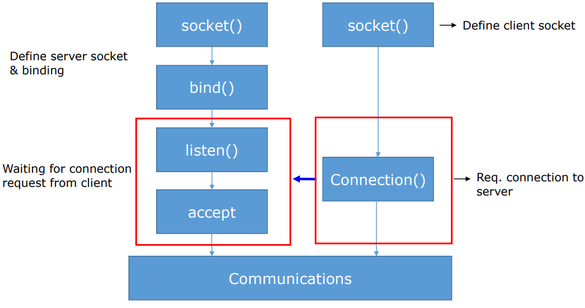

# listen(), accept(), connect()
#Computer Network/listen(), accept(), connect()

---

## Interaction Between Server & Client



## Listen()

```c
#include <sys/type.h>

int listen(int sock, int backlog);
// -> 성공 시 0, 실패 시 -1 반환
```
- sock: 연결요청 대기상태에 두고자 하는 소켓의 파일 디스크립터 전달, 이 함수의 인자로 전달된 디스크립터의 소켓이 서버 소켓(리스닝 소켓)이 된다.
- bakclog: 연결요청 대기 큐의 크기정보 전달, 5가 전달되면 큐의 크기가 5가 되어 클라이언트의 연결요청을 5개까지 대기시킬 수 있다.

## Accept()

```c
#include <sys/socket.h>

int accept(int sock, struct sockaddr * addr, socklen_t * addrlen);
// -> 성공 시 생성된 소켓의 파일 디스크립터, 실패 시 -1 반환
```
- sock: 서버 소켓의 파일 디스크립터 전달
- addr: 연결요청 한 클라이언트의 주소정보를 담을 변수의 주소 값 전달, 함수호출이 완료되면 인자로 전달된 주소의 변수에는 클라이언트의 주소정보가 채워진다.
- addrlen: 두번째 매개변수 addr에 전달된 주소의 변수 크기를 바이트 단위로 전달, 단 크기정보를 변수에 저장한 다음에 변수의 주소 값을 전달한다.

## Connect()

```c
#include <sys/socket.h>

int connect(int sock, const struct sockaddr * servaddr, socklen_t addrlen);
// -> 성공 시 0 반환, 실패 시 -1 반환
```
- sock: 클라이언트 소켓 파일 디스크립터 전달
- servadd: 연결요청 할 서버의 주소 정보 전달
- addrlen: 두번째 매개변수 servaddr에 전달된 주소의 변수 크기를 바이트 단위로 전달