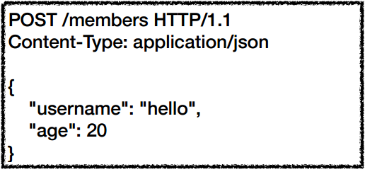
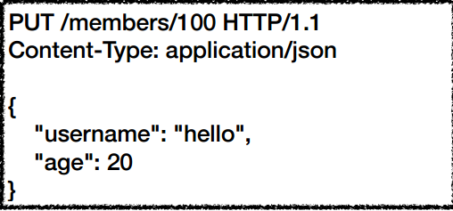

# HTTP 메서드
#TIL/HTTP/

--- 
## HTTP 메서드 종류
- GET: 리소스 조회
- POST: 요청데이터 처리, 주로 등록에 사용
- PUT: 리소스를 대체, 해당 리소스가 없으면 생성
- PATCH: 리소스 부분 변경
- DELETE: 리소스 삭제

### GET

- 리소스 조회
- 서버에 전달하고 싶은 데이터는 query(쿼리 파라미터, 쿼리 스트링)를 통해 전달

### POST

- 요청 데이터 처리
- 메시지 바디를 통해 서버로 요청 데이터 전달

### PUT

- 리소스를 대체
    - 리소스 있으면 대체
    - 리소스 없으면 생성
- 클라이언트가 리소스를 식별
    - 클라이언트가 리소스 위치를 알고 URI 지정

## HTTP 메서드의 속성

- 안전(Safe)
    - 호출해도 리소스를 변경하지 않는다.

- 멱등(Idempotent)
    - 한 번 호출하든 백 번 호출하든 결과가 똑같다.

- 캐시가능(Cacheable)
    - 응답 결과 리소스를 캐시해서 사용해도 되는가?

--- 
## 클라이언트에서 서버로 데이터 전송
- 쿼리 파라미터를 통한 데이터 전송
    - GET
    - 주로 정렬필터(검색어)
- 메시지 바디를 통한 데이터 전송
    - POST, PUT, PATCH
    - 회원가입, 상품 주문, 리소스 변경

### 4가지 상황

1. 정적 데이터 조회
    - 이미지, 정적 텍스트 문서
    - 조회는 GET 사용
    - 정적 데이터는 일반적으로 쿼리 파라미터 없이 리소스 경로로 단순하게 조회 가능

2. 동적 데이터 조회
    - 주로 검색, 게시판 목록에서 정렬 필터(검색어)
    - 조회는 GET 사용
    - GET은 쿼리 파라미터 사용해서 데이터를 전달

3. HTML Form 데이터 전송
    - HTML Form submit시 POST 전송
        - 예) 회원가입, 상품 주문, 데이터 변경
    - Content-Type: application/x-www-form-urlencoded 사용
        - form의 내용을 메시지 바디를 통해서 전송
        - 전송 데이터를 url encoding 처리
    - HTML Form은 GET 전송도 가능
    - Content-Type: multipart/form-data
        - 파일 업로드 같은 바이너리 데이터 전송시 사용
        - 다른 종류의 여러 파일과 폼의 내용 함께 전송 가능
    - HTML Form 전송은 GET, POST만 지원

4. HTTP API 데이터 전송
    - 서버 to 서버
    - 앱 클라이언트
    - 웹 클라이언트

### 컬렉션(Colletion)
- 서버가 관리하는 리소스 디렉토리
- 서버가 리소스의 URI를 생성하고 관리

### 스토어(Store)
- 클라이언트가 관리하는 리소스 저장소
- 클라이언트가 리소스의 URI를 알고 관리

### 컨트롤 URI
- 동사로 된 리소스 경로 ex) /new, /edit, /delete
- HTTP 메서드로 해결하기 애매한 경우 사용

 