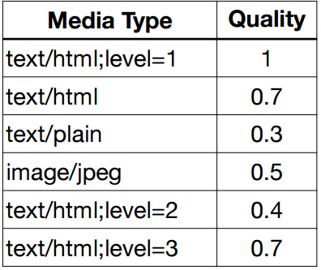

# HTTP 헤더1 - 일반헤더
#TIL/HTTP/

---
## 표현

### Content-Type
표현 데이터의 형식 설명
- 미디어 타입, 문자 인코딩
- 예)
    - text/html; charset=utf-8
    - application/json
    - image/png

### Content-Encoding
표현 데이터 인코딩
- 표현데이터를 압축하기 위해 사용
- ex) Content-Encoding: gzip

### Content-Language
표현 데이터의 자연 언어
- ex) Content-Language: ko

### Content-Length
표현 데이터의 길이
- 바이트 단위
- ex) Content-Length: 5
---
## 협상(Context Negotiation)
클라이언트가 선호하는 표현 요청
- Accpet: 클라이언트가 선호하는 미디어 타입 전달
- Accpet-Charset: 클라이언트가 선호하는 문자 인코딩
- Accpet-Encoding: 클라이언트가 선호하는 압축 인코딩
- Accept-Language: 클라이언트가 선호하는 자연 언어
- 협상 헤더는 요청시에만 사용

### 협상과 우선순위1
Quality values(q)

- Quality values(q)값 사용
- 0~1, 클수록 높은 우선순위
- 생략하면 1
- ex) Accept-Language: ko-KR,ko;q=0.9,en-US;q=0z.8,en;q=0.7

### 협상과 우선순위2
- 구체적인 것이 우선한다.
- ex) Accept: text/*, text/plain, text/plain;format=flowed, */*
    1. text/plain;format=flowed
    2. text/plain
    3. text/*
    4. */*

### 협상과 우선순위3
- 구체적인 것을 기준으로 미디어 타입을 맞춘다
- ex) text/*;q=0.3, text/html;q=0.7, text/html;level=1, text/html;level=2;q=0.4, */*;q=0.5

---

## 전송 방식

### 단순 전송
Content-Length

### 압축 전송
Content-Encoding

### 분할 전송
Transfer-Encoding

### 범위 전송
Range, content-Range

---

## 일반 정보

### From
유저 에이전트의 이메일 정보

### Referer
이전 웹 페이지 주소
- Refer를 사용해서 유입 경로 분석 가능

### User-Agent
유저 에이전트 애플리케이션 정보

### Server
요청을 처리하는 Origin 서버의 소프트웨어 정보

### Date
메시지가 발생한 날짜와 시간

## 특별한 정보

### Host
요청한 도메인의 정보
- 필수
- 하나의 서버가 여러 도메인을 처리해야 할 때

### Location
페이지 리다이렉션

### Allow
허용 가능한 HTTP 메서드

### Retry-After
유저 에이전트가 다음 요청을 하기까지 기다려야 하는 시간

## 인증 

### Authorization
클라이언트 인증 정보를 서버에 전달

### WWW-Authenticate
리소스 접근시 필요한 인증 방법 정의
- 401 Unauthorized 응답과 함께 사용
- WWW-Authenticate: Newauth realm="apps", type=1, title="Login to \"apps\"", Basic realm="simple"

---

## 쿠키
- Set-Cookie: 서버에서 클라이언트로 쿠키 전달(응답)
- Cookie: 클라이언트가 서버에서 받은 쿠키를 저장하고, HTTP 요청시 서버로 전달
- 예) set-cookie: sessionId=abcde1234; expires=Sat, 26-Dec-2020 00:00:00 GMT; path=/; domain=.google.com; Secure
- 사용처
    - 사용자 로그인 세션 관리
    - 광고 정보 트래킹
- 쿠키는 항상 서버에 전송됨
    - 네트워크 트래픽 추가 유발
    - 최소한의 정보만 사용(세션 id, 인증 토큰)
    - 서버에 전송하지 않고, 웹 브라우저 내부에 저장하고 싶으면 웹 스토리지

### 쿠키 - 생명주기
- Set-Cookie: expires=Sat, 26-Dec-2020 04:39:21 GMT
    - 만료일이 되면 쿠키 삭제
- Set-Cookie: max-age=3600 (3600초)
    - 0이나 음수를 지정하면 쿠키 삭제
- 세션 쿠키: 만료 날짜를 생략하면 브라우저 종료시 까지만 유지
- 영속 쿠키: 만료 날짜를 입력하면 해당 날짜까지 유지

### 쿠키 - 도메인
- 명시: 명시한 문서 기준 도메인 + 서브 도메인 포함
- 생략: 현재 문서 기준 도메인만 적용

### 쿠키 - 경로
- 이 경로를 포함한 하위 경로 페이지만 쿠키 접근
- 일반적으로 path=/ 루트로 지정
- ex)
    - path=/home 지정
    - /home -> 가능
    - /home/level -> 가능
    - /hello -> 불가능

### 쿠키 - 보안
- Secure
    - 쿠키는 http, https를 구분하지 않고 전송
    - Secure 적용하면 https인 경우에만 전송
- HttpOnly
    - 자바스크립트에서 접근 불가
    - HTTP 전송에만 사용
- SameSite
    - 요청 도메인과 쿠키에 설정된 도메인이 같은 경우만 쿠키 전송

---
참고
https://www.inflearn.com/course/http-%EC%9B%B9-%EB%84%A4%ED%8A%B8%EC%9B%8C%ED%81%AC#