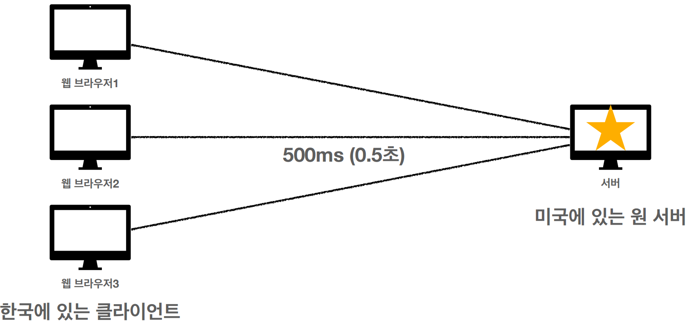
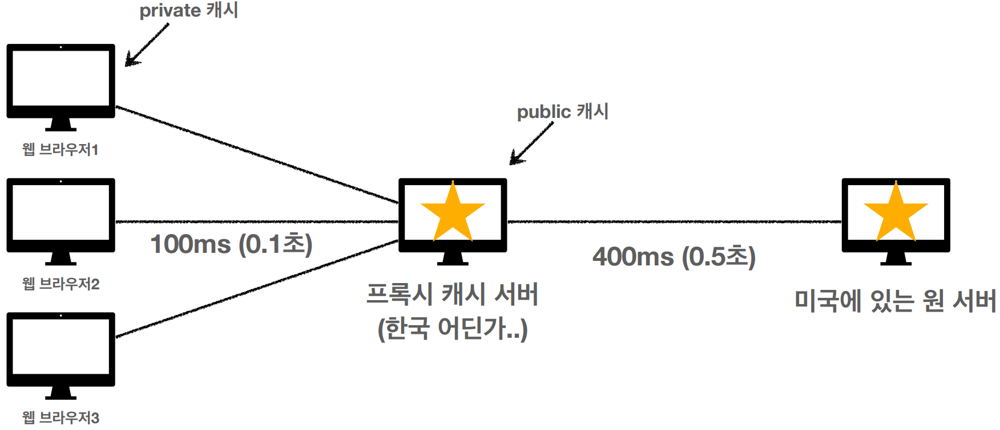
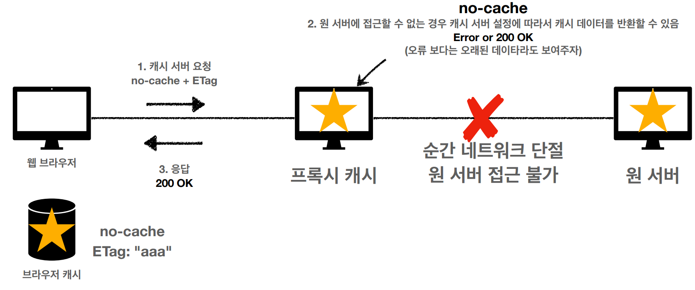
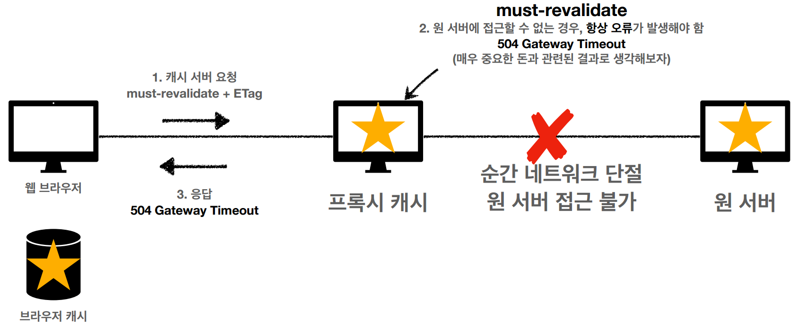

# HTTP 헤더2 - 캐시와 조건부 요청
#TIL/HTTP/

---
## 캐시 기본 동작

### 캐시가 없을 때
- 데이터가 변경되지 않아도 계속 네트워크를 통해서 다운로드 받아야 한다.
- 인터넷 네트워크는 매우 느리고 비싸다
- 브라우저 로딩 속도가 느리다.

### 캐시 적용
- 캐시 덕분에 캐시 가능 시간동안 네트워크를 사용하지 않아도 된다.
- 비싼 네트워크 사용량 줄일 수 있다.
- 브라우저 로딩 속도가 매우 빠르다.

### 캐시 시간 초과
- 캐시 유효 시간이 초과하면 서버를 통해 다시 데이터 조회하고, 캐시를 갱신한다.
- 이때 네트워크 다운로드가 다시 발생

만약 똑같은 데이터면 캐시 재사용 가능

But 어떻게 같다고 확인?

## 검증 헤더와 조건부 요청
(Last-Modified - If-Modified-Since / ETag - If-None-Match)

- 캐시 유효 시간이 초과해도, 서버의 데이터가 갱신 되지 않으면
- 304 Not Modified + 헤더 메타 정보만 응답(바디X)
- 클라이언트는 서버가 보낸 응답 헤더 정보로 캐시의 메타 정보를 갱신
- 클라이언트는 캐시에 저장되어 있는 데이터 재활용
- 결과적으로 네트워크 다운로드가 발생하지만 용량이 적은 헤더정보만 받음

### Last-Modified, If-Modified-Since 단점
- 1초 미만 단위로 캐시 조정이 불가능
- 날씨 기반의 로직 사용
- 데이터를 수정해서 날짜가 다르지만, 같은 데이터 수정해서 데이터 결과가 똑같은 경우
- 서버에서 별도의 캐시 로직을 관리하고 싶은 경우

### -> ETag, If None-Match
- ETag(Entity Tag)
- 캐시용 데이터에 임의의 고유한 버전 이름을 달아둠
    
    ex) 예) ETag: "v1.0", ETag: "a2jiodwjekjl3"

- 진짜 단순하게 ETag만 보내서 같으면 유지, 다르면 다시 받기!
- 캐시 제어 로직을 서버에서 완전히 관리

## 캐시 제어 헤더

### Cache-Control
캐시 지시어(directives)

- Cache-Control: max-age
    - 캐시 유효 시간, 초단위

- Cache-Control: no-cache
    - 데이터는 캐시해도 되지만, 항상 원(origin) 서버에 검증하고 사용

- Cache-Control: no store
    - 데이터에 민감한 정보가 있으므로 저장하면 안됨(메모리에서 사용하고 최대한 빨리 삭제)

### Pragma
캐시제어(하위호환)

- Pragma: no-cache
- HTTP 1.0 하위 호환

### Expires
캐시 만료일 지정(하위 호환)

## 프록시 캐시

### 원서버 직접 접근
origin 서버

### 프록시 캐시 도입

Cache-Control: public
- 응답이 public 캐시에 저장되어도 됨

Cache-Control: private
- 응답이 해당 사용자만을 위한 것임, private 캐시에 저장해야 함(기본값)

## 캐시 무효화

### 확실한 캐시 무효화 응답
- Cache-Control: no-cache, no-store, must-revalidate
- Pragma: no-cache
    - HTTP 1.0 하위 호환

Cache-Control: must-revalidate
- 캐시 만료후 최초 조회시 원 서버에 검증해야함
- 원 서버 접근 실패 시 반드시 오류가 발생해야함

no-cache vs must-revalidate

no-cache

must-revalidate

---
참고
https://www.inflearn.com/course/http-%EC%9B%B9-%EB%84%A4%ED%8A%B8%EC%9B%8C%ED%81%AC#