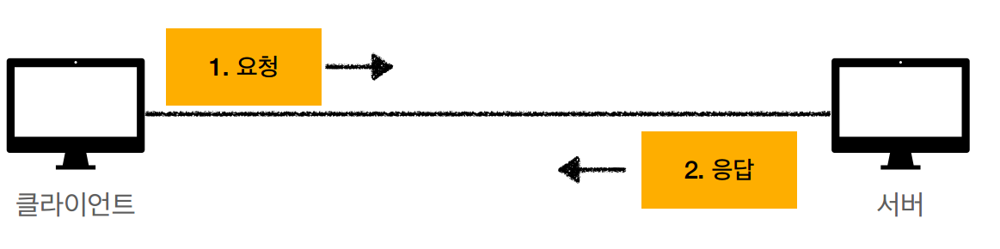
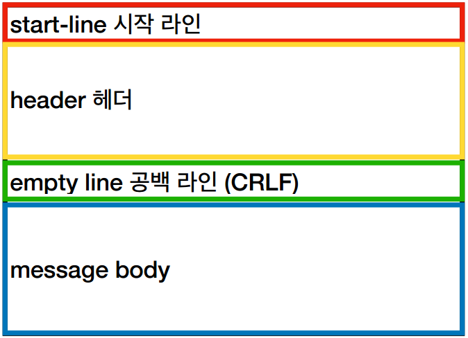
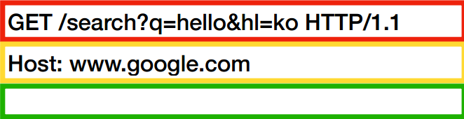
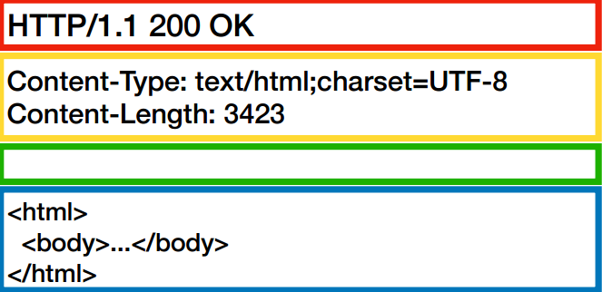

# HTTP
#TIL/HTTP/

---
## HTTP(HyperText Transfer Protocol)
HTTP 메시지에 모든 것을 전송
- HTML, TEXT
- IMAGE, 음성, 영상, 파일
- JSON, XML
- 거의 모든 형태 데이터 전송 가능
- 서버간에 데이터를 주고 받을 때도 대부분 HTTP 사용

### 기반 프로토콜
- TCP: HTTP/1.1, HTTP/2
- UDP: HTTP/3
- 현재 주로 HTTP/1.1 주로 사용

### HTTP 특징
1. 클라이언트 서버 구조
    - Request Response 구조

2. 무상태 프로토콜(Stateless) <-> stateful
    - 서버가 클라이언트의 상태를 보존 X
    - 장점: 서버 확장성 높음(스케일 아웃)
    - 단점: 클라이언트가 추가 데이터 전송

3. 비연결성
    - HTTP는 기본이 연결을 유지하지 않는 모델
    - 일반적으로 초 단위 이하의 빠른 속도로 응답
    - 서버 자원을 매우 효율적으로 사용할 수 있음
    - 한계와 극복
        - TCP/IP 연결을 새로 맺어야 함 + 많은 자원 다운로드
        - HTTP 지속연결(Persistent Connections)로 문제 해결

- HTTP 메시지

4. HTTP 메시지 구조

HTTP 요청 메시지

시작라인

request-line = method/request-target/ HTTP-version

### method(HTTP method)
- 종류: GET, POST, PUT, PATCH, DELETE...
- 서버가 수행해야 할 동작 지정
    - GET: 리소스 조회
    - POST: 요청 내역 처리

### request-target(요청 대상)
- absoulte-path[?query]

HTTP 응답 메시지

시작라인

status-line = HTTP-version status-code reason-phrase
- HTTP 버전
- HTTP 상태 코드: 요청 성공, 실패를 나타냄
    - 200: 성공
    - 400: 클라이언트 요청 실패
    - 500: 서버 내부 오류
- 이유 문구: 사람이 이해할 수 있는 짧은 상태 코드 설명 글

HTTP 헤더
- header-field = field-name: field-value
- field-name은 대소문자 구분 없 음

HTTP 메시지 바디
- 실제 전송할 데이터
- HTML 문서, 이미지, 영상, JSON 등등 byte로 표현할 수 있는 모든 데이터 전송 가능

5. 단순함, 확장 가능

---
참고
https://www.inflearn.com/course/http-%EC%9B%B9-%EB%84%A4%ED%8A%B8%EC%9B%8C%ED%81%AC#