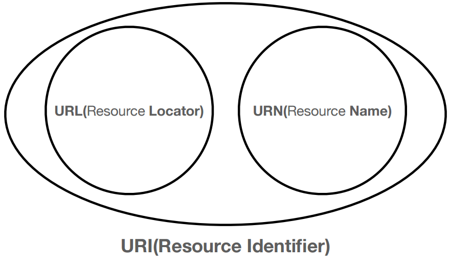

# URI와 웹 브라우저 요청 흐름
#TIL/Http/

---

## URI(Uniform Resource Identifier)

URL-Locator: 리소스가 있는 위치 지정

URL-Name: 리소스에 이름을 부여

위치는 변활수 있지만, 이름은 변하지 않는다.

## URL
전체 문법

scheme://[userinfo@]host[:port][/path][?query][#fragment]

ex) https://www.google.com:443/search?q=hello&hl=ko

### scheme
- 주로 프로토콜 사용
- 프로토콜 : 어떤 방식으로 자원에 접근할 것인가 하는 약속 규칙
    - ex) http, https, ftp 등등
- http는 80 포트, https는 443 포트를 주로 사용, 포트는 생략 가능
- https는 http에 보안 추가(HTTP Secure)

### userinfo
- URL에 사용자 정보를 포함해서 인증
- 거의 사용하지 않음

### host
- 도메인명 또는 IP 주소를 직접 사용가능

### port
- 접속 포트
- 일반적으로 생략, 생략시 http는 80, https는 443

### path
- 리소스 경로(path), 게층적 구조

### query
- key=value 형태
- ?로 시작, &로 추가기능 
- query parameter, query string으로 불림

### fragment
- html 내부 북마크 등에 사용
- 서버에 전송하는 정보 아님

---
참고
https://www.inflearn.com/course/http-%EC%9B%B9-%EB%84%A4%ED%8A%B8%EC%9B%8C%ED%81%AC#