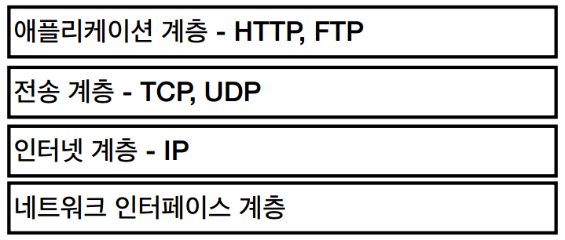
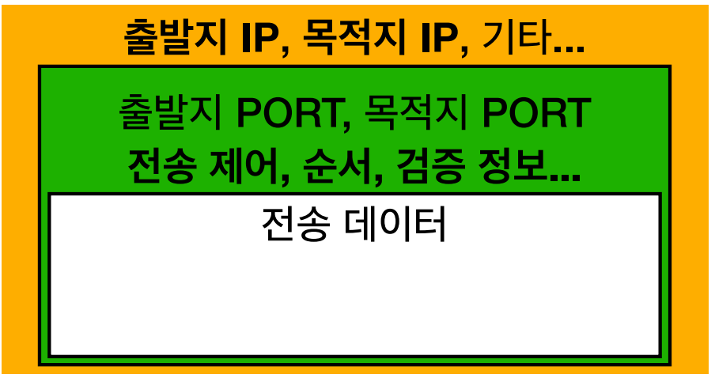
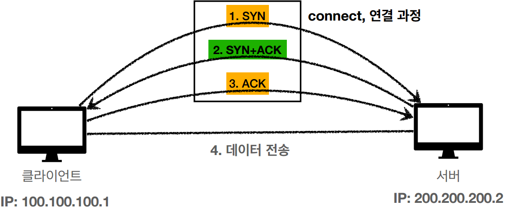
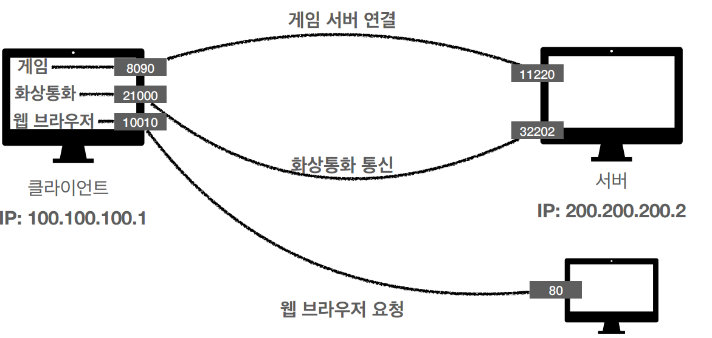
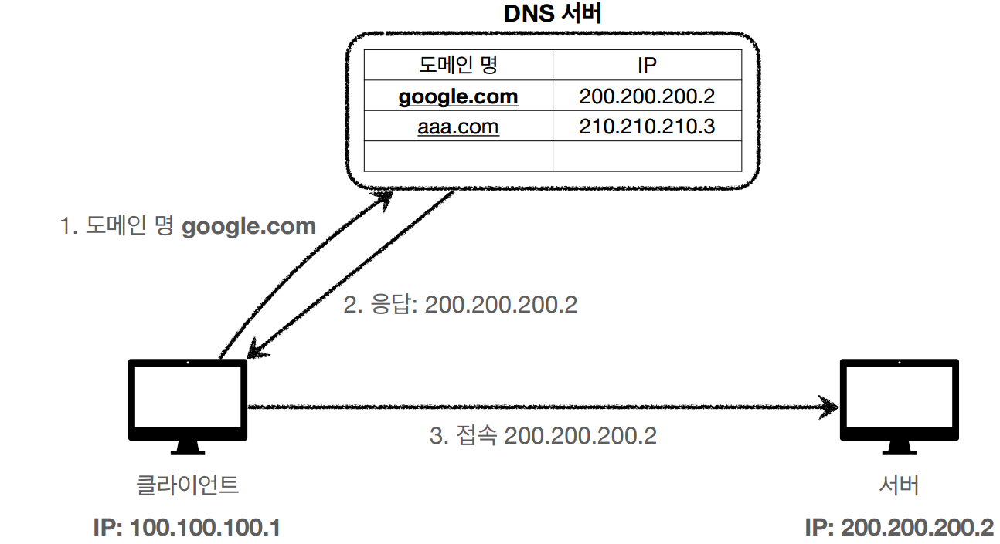

# 인터넷 네트워크
#TIL/Http/

---
## IP(Internet Protocol)
인터넷 프로토콜 역활
- 지정한 IP 주소에 데이터 전달
- 패킷이라는 통신 단위로 데이터 전달

### IP 프로토콜의 한계
- 비연결성
    - 패킷을 받을 대상이 없거나 서비스 불능 상태여도 패킷 전송
- 비신뢰성
    - 중간에 패킷이 사라지면?
    - 패킷이 순서대로 안오면?
- 프로그램 구분
    - 같은 IP를 사용하는 서버에서 통신하는 애플리케이션 둘 이상이면?

### 인터넷 프로토콜 스택의 4계층

### TCP/IP 패킷 정보

## TCP
전송 제어 프로토콜(Transmission Control Protocol)

- 연결지향 - TCP 3 way handshake(가상 연결)
- 데이터 전달 보증
- 순서 보장
- 신뢰할 수 있는 프로토콜
- 현재는 대부분 TCP 사용

### TCP 3 way handshake

SYN: 접속 요청
ACK: 요청 수락

## UDP
사용자 데이터그램 프로토콜(User Datagram Protocol)

- 기능이 거의 없음
- 데이터 전달 및 순서가 보장되지 않지만, 단순하고 빠름
- IP와 거의 같고 + PORT + 체크섬 정도만 추가

## PORT
같은 IP내에서 프로세스 구분

## DNS
도메인 네임 시스템(Domain Name System)
- 도메인 명을 IP 주소로 변환

---
참고
https://www.inflearn.com/course/http-%EC%9B%B9-%EB%84%A4%ED%8A%B8%EC%9B%8C%ED%81%AC#