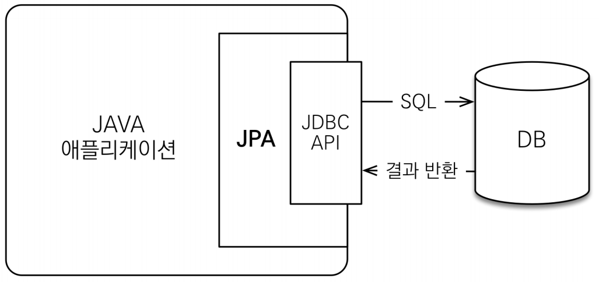
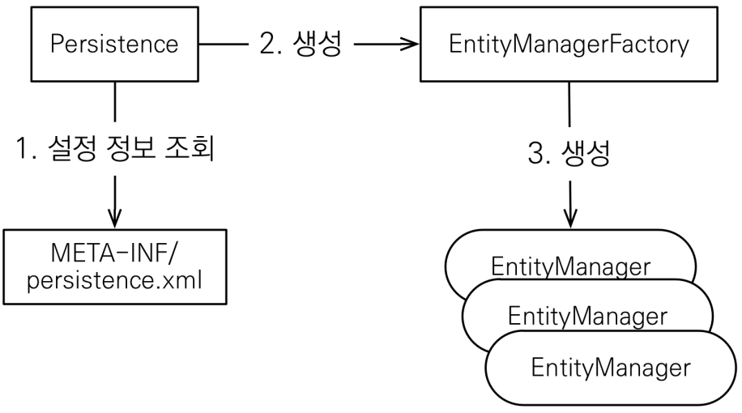

# JPA 시작
#TIL/JPA기본/

---

## ORM
- Object-relational-mapping(객체 관계 매핑)
- 객체는 객체대로 설계
- 관계형 데이터베이스는 관계형 데이터베이스대로 설계
- ORM 프레임 워크가 중간에서 매핑

### JPA를 왜 사용?
- SQL 중심적인 개발에서 객체 중심으로 개발
- 생산성
- 유지보수
- 패러다임 불일치 해결

## JPA 구동 방식

- 엔티티 매니저 팩토리는 하나만 생성해서 애플리케이션 전체에서 공유
- 엔티티 매니저는 쓰레드간에 공유 X( 사용하고 버려야 됨)
- JPA의 모든 데이터 변경은 트랜잭션 안에서 실행

---
참고
https://www.inflearn.com/course/ORM-JPA-Basic#