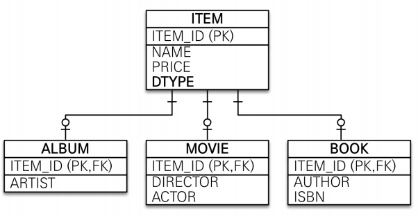
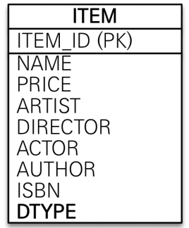
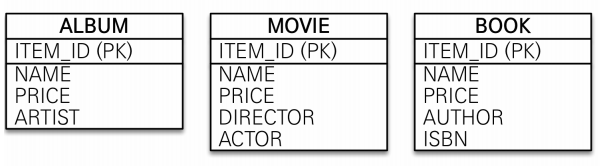
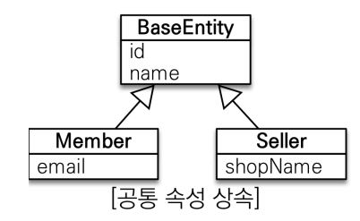
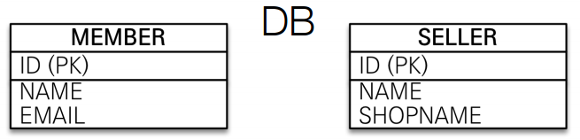

# 고급 매핑
#TIL/JPA 기본

---

## 상속관계 매핑
- 관계형 데이터베이스는 상속관계X
- 슈퍼타입 서브타입 관계라는 모델링 기법이 객체 상속과 유사
- 상속관계 매핑: 객체의 상속 구조와 DB의 슈퍼타입 서브타입 관계를 매핑

### 조인전략
@Inheritance((strategy=InheritanceType.JOINED)

=> 각각 테이블로 변환

- 장점
    - 테이블 정규화
    - 외래 키 참조 무결성 제약조건 활용가능
    - 저장공간 효율화

- 단점
    - 조회시 조인을 많이 사용, 성능 저하
    - 조회 쿼리가 복잡
    - 데이터 저장시 INSERT SQL 2번 호출

### 단일 테이블 전략
@Inheritance((strategy=InheritanceType.SINGLE_TABLE)

=> 통합 테이블로 변환

- 장점
    - 조인이 필요 없으므로 일반적으로 조회 성능 빠름
    - 조회 쿼리 단순

- 단점
    - 자식 엔티티가 매핑한 컬럼은 모두 null 허용
    - 단일 테이블에 모든 것을 저장하므로 테이블이 커져서 조회 성능이 오히려 느려질 수 있음

### 구현 클래스마다 테이블 전략
@Inheritance((strategy=InheritanceType.TABLE_PER_CLASS)

=> 서브타입 테이블로 변환

- 이 전략은 데이터베이스 설계자와 ORM 전문가 둘 다 추천X 
- 장점
    - 서브 타입을 명확하게 구분해서 처리할 때 효과적
    - not null 제약조건 사용 가능

- 단점
    - 여러 자식 테이블을 함께 조회할 때 성능 느림
    - 자식 테이블을 통합해서 쿼리하기 어려움

## MappedSuperclass
공통 매핑 정보가 필요할때 사용

- 상속관계 매핑X
- 엔티티X, 테이블과 매핑X
- 부모 클래스를 상속받는 자식 클래스에 매핑 정보만 제공
- 직접 사용할 일 없으므로 추상 클래스 권장

---
참고
https://www.inflearn.com/course/ORM-JPA-Basic#