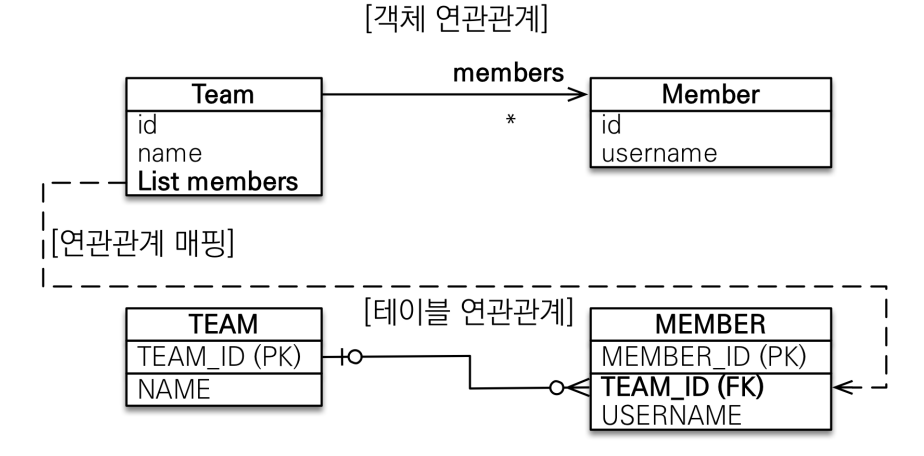
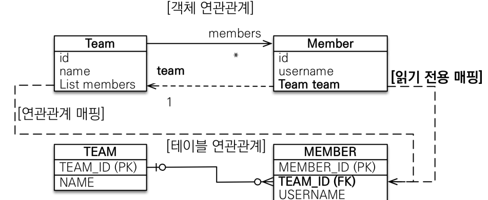

# 다양한 연관관계 매핑
#TIL/JPA 기본/

---
@Need Re

## 다대일 [N:1]

- 가장 많이 사용하는 연관관계

## 일대다 [1:N]

### 일대다 단방향

- 테이블 일대다 관계는 항상 다(N)쪽에 외래 키가 있음
- @JoinColumn을 꼭 사용해야 함. 그렇지 않으면 조인 테이블 방식을 사용함(중간에 테이블을 하나 추가함)

### 일대다 양방향

- 이런 매핑은 공식적으로 존재X
- @JoinColumn(insertable=false, updatable=false)
- 읽기 전용 필드 사용해서 양뱡항 처럼 사용하는 방법

## 일대일 [1:1]

- 주 테이블이나 대상 테이블 중에 외래 키 선택 가능
- 외래 키에 데이터베이스 유니크(UNI) 제약조건 추가

## 다대다 [N:M]

- 관계형 데이터베이스는 정규화된 테이블 2개로 다대다 관게를 표현할 수 없음
- 연결 테이블을 추가해서 일대다, 다대일 관계로 풀어내야함
- 편리해보이지만 실무에서 사용X

---
참고
https://www.inflearn.com/course/ORM-JPA-Basic#