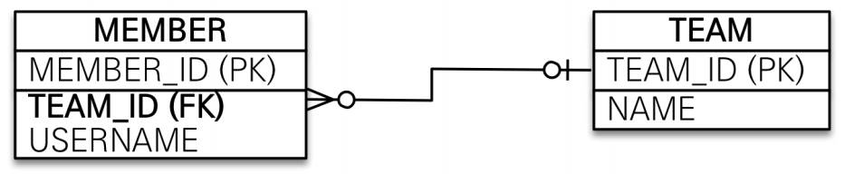

# 연관관계 매핑
#TIL/JPA 기본/

--- 
- 객체와 테이블의 연관관계의 차이를 이해

- 객체의 참조와 테이블의 외래 키를 매핑

## 단방향 연관관계



```Java
@Entity
public class Member { 
@Id @GeneratedValue
private Long id;
@Column(name = "USERNAME")
private String name;
private int age;

@ManyToOne
@JoinColumn(name = "TEAM_ID")
private Team team;
...
```

## 양방향 연관관계와 연관관계의 주인

### 양뱡향 연관관계

 단방향 Code +
```java
@Entity
public class Team {
@Id @GeneratedValue
private Long id;
private String name;
@OneToMany(mappedBy = "team")
List<Member> members = new ArrayList<Member>();
… 
}
```
- 객체의 양뱡향 관계는 양방향 관계가 아니라 서로 다른 단방향 관계 2개다.

- 테이블은 외래 키 하나로 두 테이블의 연관관계를 정리

### 연관관계의 주인
양방향 매핑 규칙
- 객체의 두 관계중 하나를 연관관계 주인으로 지정
- 연관관계의 주인만이 외래 키를 관리(등록, 수정)
- 주인이 아닌 쪽은 읽기만 가능
- 외래키가 있는 곳을 주인으로

#### 양방향 매핑시 가장 많이 하는 실수
연관관계의 주인에  값을 입력하지 않음

#### 양방향 연관관계 주의 - 실습
- 순수 객체 상태를 고려해서 항상 양쪽에 값을 설정
- 연관관계 편의 메소드를 생성
- 양방향 매핑시에 무한루프 조심

    ex) tostring(), lombok, JSON 생성 라이브러리


단방향 매핑만으로도 이미 연관관계 매핑은 완료

양뱡향 매핑은 반대  방향으로 조회(객체 그래프 탐색) 기능이 추가된 것 뿐


---
참고
https://www.inflearn.com/course/ORM-JPA-Basic#