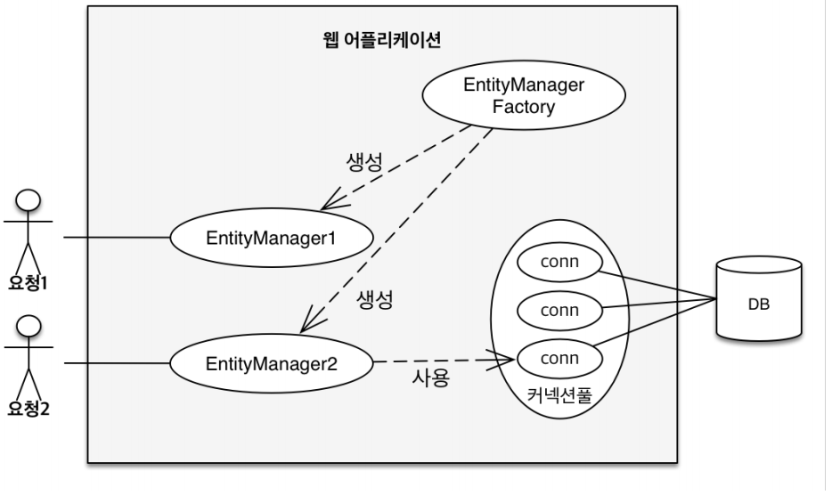

# 영속성 관리
#TIL/JPA 기본/

---

## 엔티티 매니저 팩토리와 엔티티 매니저

## 영속성 컨텍스트
엔티티를 영구 저장하는 환경이라는 뜻

엔티티 매니저를 통해서 영속성 컨텍스트에 접근

### 엔티티의 생명주기

- 비영속(new/transient)

    영속성 컨텍스트와 전혀 관계가 없는 새로운 상태

- 영속(managed)

    영속성 컨텍스트에 관리되는 상태

- 준영속(detached)

    영속성 컨텍스트에 저장되었다가 분리된 상태

- 삭제(removed)

    삭제된 상태

### 영속성 컨텍스트의 이점
- 1차 캐시

- 동일성 보장

- 트랜잭션을 지원하는 쓰기 지연

- 변경 감지

- 지연 로딩

## 플러시
영속성 컨텍스트의 변경내용을 데이터베이스에 반영

### 플러시 방법
- em.flush() - 직접 호출
- 트랜잭션 커밋 - 플러시 자동 호출
- JPQL 쿼리 실행 - 플러시 자동 호출

## 준영속 상태
- 영속 -> 준영속
- 영속 상태의 엔티티가 영속성 컨텍스트에서 분리(detached)
- 영속성 컨텍스트에서 제공하는 기능을 사용 못함

## 준영속 상태로 만드는 방법
- em.detach(entity)

    특정 엔티티만 준영속 상태로 전환

- em.clear();

    영속성 컨텍스트를 완전히 초기화

- em.close();

    영속성 컨텍스트를 종료

---
참고
https://www.inflearn.com/course/ORM-JPA-Basic#