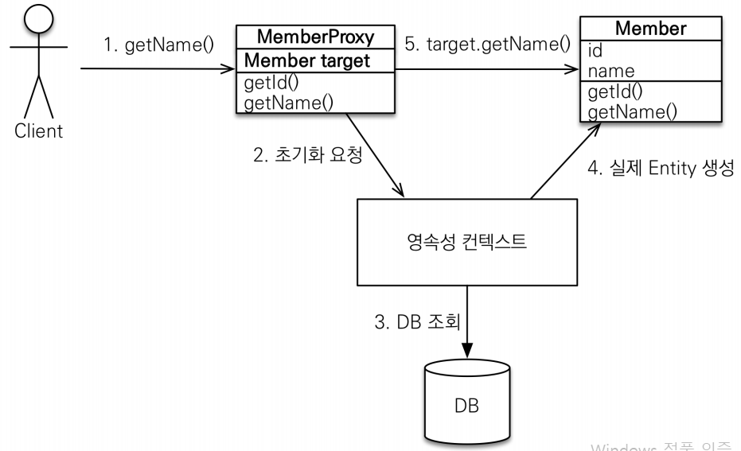

# 프록시와 연관관계 관리
#TIL/JPA 기본

---
## 프록시
- em.find(): 데이터베이스를 통해서 실제 엔티티 객체 조회
- em.getReference(): 데이터베이스 조회를 미루는 가짜(프록시) 엔티티 객체 조회

- 실제 클래스를 상속 받아서 만들어짐
- 실제 클래스와 겉모양이 같다

### 프록시 객체의 초기화

- 프록시 객체는 처음 사용할 때 한번만 초기화
- 프록시 객체를 초기화 할 때, 프록시 객체가 실제 엔티티로 바뀌는 것은 아님, 초기화되면 프록시 객체를 통해 실제 엔티티에 접근 가능
- 타입 체크시 주의( == 대신 instance of 사용)
- 영속성 컨텍스트에 찾는 엔티티가 이미 있으면 em.getReference()를 호출해도 실제 엔티티 반환
- 준영속 상태일 때, 프록시를 초기화하면 문제 발생

## 즉시로딩과 지연로딩

### 지연로딩
LAZY를 사용해서 프록시로 조회( fetch = FETCHTYPE.LAZY)

### 즉시로딩
EAGER를 사용해서 함께 조회( fetch = FETCHTYPE.EAGER)

프록시와 즉시로딩 주의
- 가급적 지연 로딩만 사용(특히 실무에서)
- 즉시 로딩을 적용하면 예상치 못한 SQL이 발생
- 즉시 로딩은 JPQL에서 N+1 문제 일으킨다.
- @ManyToOne, @OneToOne은 기본이 즉시 로딩 -> LAZY로 설정
- @OneToMany, @ManyToMany는 기본이 지연 로딩

## 영속성 전이: CASCADE
( cascade=CascadeType.~)
- 특정 엔티티를 영속 상태로 만들 때 연관된 엔티티도 함께 영속 상태로 만들도 싶을 때
- ex) 부모 엔티티를 저장할 때 자식 엔티티도 함께 저장

CASCADE 종류
- ALL: 모두 적용
- PERSIST: 영속
- REMOVE: 삭제

## 고아 객체

- 고아 객체 제거: 부모 엔티티와 연관관계가 끊어진 자식 엔티티를 자동으로 삭제
- orphanRemoval = true;
- 참조하는 곳이 하나일 때 사용해야함!
- 특정 엔티티가 개인 소유할 때 사용

---
참고
https://www.inflearn.com/course/ORM-JPA-Basic#