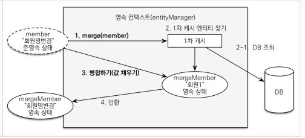

# JPA 활용1
#TIL/JPA 활용1/

---
## 도메인 분석 설계

기능 목록
- 회원 기능
    - 회원 등록
    - 회원 조회
- 상품 기능
    - 상품 등록
    - 상품 수정
    - 상품 조회
- 주문 기능
    - 상품 주문
    - 주문 내역 조회
    - 주문 취소

예제를 단순화 하기 위해 다음 기능은 구현X
- 로그인과 권한 관리X
- 파라미터 검증과 예외 처리X
- 상품은 도서만 사용
- 카테고리는 사용X
- 배송 정보는 사용X

## 엔티티 설계시 주의점

- 엔티티에는 가급적 Setter를 사용 X

- 모든 연관관계는 지연로딩으로 설정
    - 연관된 엔티티를 함께 DB에서 조회해야 하면, fetch join 또는 엔티티 그래프 기능을 사용

- 컬렉션은 필드에서 초기화 하자
    - null 문제에서 안전

기술 설명

- @PersistenceContext: 엔티티 매니저 주입
- @PersistenceUnit: 엔티티 매니저 팩토리 주입
- @Transactional: 트랜잭션, 영속성 컨텍스트
    - readOnly = true: 데이터의 변경이 없는 읽기 전용 메서드에 적용, 영속성 컨텍스트를 플러시 하지 않으므로 약간의 성능 향상
- @Runwith(SpringRunner.class): 스프링과 테스트 통합
- @SpringBootTest: 스프링 부트 띄우고 테스트

참고: 
- 엔티티가 비즈니스 로직을 가지고 객체 지향의 특성을 적극 활용하는 것을 도메인 모델 패턴
- 엔티티에는 비즈니스 로직이 거의 없고 서비스 계층에서 대부분의 비지니스 로직을 처리하는 것을 트랜잭션 스크립트 패턴

## 변경감지와 병합(merge)

### 준영속 엔티티

영속성 컨텍스트가 더는 관리하지 않는 엔티티(임의로 만들어낸 엔티티도 기존 식별자 가지고 있으면 준영속 엔티티)

### 준영속 엔티티 수정하는 방법
1. 변경 감지 기능 사용
영속성 컨텍스트에서 엔티티를 다시 조회한 후에 데이터를 수정

2. 병합 사용

1. merge() 실행
2. 파라미터로 넘어온 준영속 엔티티(member) 식별자 값으로 1차 캐시에서 엔티티조회( 1차 캐시에 엔티티 없으면 DB에서 엔티티 조회후 1차캐시에 저장)
3. 조회한 영속 엔티티(mergeMember)에 member 엔티티 값을 채워 넣는다.
4. 영속 상태인 mergeMember 반환

주의: 변경 감지 사용하면 원하는 속성만 선택해서 변경할 수 있지만, 병합을 사용하면 모든 속성이 변경된다. 병합 시 값이 없으면 null로 업데이트 할 위험도 있다.

### 가장 좋은 해결 방법
엔티티를 변경할 때는 항상 변경 감지 사용

- 컨트롤러에서 어설프게 엔티티 생성X
- 트랜잭션이 있는 서비스 계층에 식별자(id)와 변경할 데이터를 명확하게 전달(파라미터 or dto)

---
참고
https://www.inflearn.com/course%EC%8A%A4%ED%94%84%EB%A7%81%EB%B6%80%ED%8A%B8-JPA-%ED%99%9C%EC%9A%A9-1#

