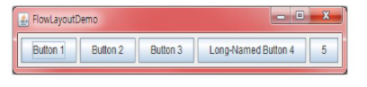
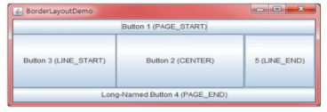
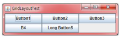

# 그래픽 사용자 인터페이스, 인터페이스, 람다식
#TIL/Java/

---
## 그래픽 사용자 인터페이스

- 컨테이너 컴포넌트

     다른 컴포넌트를 안에 포함할 수 있는 컴포넌트로서 JFrame, JDialog, JApplet, JPanel, JScrollPanel 등이 있다.

- 단순 컴포넌트

    단순한 컴포넌트로서 JButton, JLabel, JCheckbox, JTextField 등이 있다.


*어플리케이션 GUI 작성하려면 하나의 최상위 컨테이너(JFrame, JDialog, JApplet) 생성해야함.


### 배치 관리자

- FLOWLAYOUT

    : 컴포넌트들을 왼쪽에서 오른쪽으로 버튼을 배치

    

- BORDERLAYOUT

    : 컴포넌트들이 5개의 영역인 North(상), South(하), East(우측), West(좌측), Center(중앙)중 하나로 추가

    

- GRIDLAYOUT

    : 컴포넌트를 격자 모습으로 배치(모든 컴포넌트들의 크기 같음)

    


## 인터페이스(Interface)
: 인터페이스는 클래스와 클래스 사이 상호 작용 규격(추상 클래스)

```java
public interface 인터페이스_이름 {
    반환형 추상메소드1(...);
    반환형 추상메소드2(...);
    ...
}
```

### 인터페이스 구현

```java
public class 클래스_이름 implements 인터페이스_이름 {
    반환형 추상메소드1(...) {
        .....
    }
    반환형 추상메소드2(...) {
        .....
    }
}
```

인터페이스 안

+디폴트 메소드

+정적 메소드

디폴트 메소드 ,정적 메소드는 클래스에서 구현하지 않아도 바로 사용가능

*인터페이스 다중 상속 가능

### 람다식
: 이름 없는 메소드 (함수 독립적으로 사용하게 함)

(argument) -> (body)

```java
() -> System.out.println("Hello World");

() -> { return 3.141592; }
```

ex)
```java
//이전의 방법
button.addActionListener( new ActionListener() {
    @Override
    public void actionPerformed(ActionEvent e) {
        System.out.println("버튼이 클릭되었음!");
    }
});
```

```java
// 람다식 사용
button.addActionListener( (e) -> {
    System.out.println("버튼이 클릭되었음");
});
```


