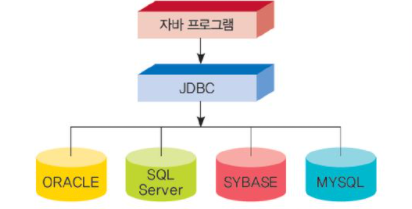
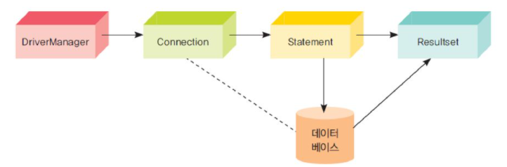

# 데이터베이스 프로그래밍
#TIL/Java/

---

## 자바와 데이터베이스

JDBC(Java Database Connectivity): 자바르포그램에서 데이터베이스에 연결하여 데이터를 검색할 수 있게 하는 라이브러리.



---

## SQL(Structured query language)
: 관계형 데이터베이스에서 사용하기 위해 설계된 언어

구분|명령어|설명
---|---|---|
데이터 정의 명령어|CREATE| 테이블 생성.
-|ALTER|테이블에서 컬럼을 추가하거나 삭제한다.
-|DROP|테이블 삭제
-|USE| 어떤 데이터베이스 사용하는지 지정

구분|명령어|설명
---|---|---|
데이터 조작 명령어|SELECT| 데이터 출력
-|INSERT|새로운 레코드 추가
-|DELETE|지정된 레코드 삭제
-|UPDATE|레코드값 변경


### 데이터베이스 생성
```SQL
CREATE TABLE 테이블이름 (컬럼이름1 자료형1, 컬럼이름2 자료형2, ...);
```

### 레코드 추가하기
```SQL
INSERT INTO 테이블이름(컬럼이름1, 컬럼이름2, ...)
VALUES(값1, 값2, ...)
```

### 레코드 검색하기
```SQL
SELECT 컬럼이름 FROM 테이블이름 [ WHERE 조건 ] [ ORDER BY 정렬방식]
```

### 레코드 수정하기
```SQL
UPDATE 테이블이름 SET 컬럼명 = 새로운값, ... [ WHERE 조건 ]
```

### 레코드 삭제하기
```SQL
DELETE FROM 테이블이름 [WHERE 조건 ]
```

---

## JDBC를 이용한 프로그래밍

1. JDBC 드라이버를 적재
```java
Class.forName("com.mysql.jdbc.Driver");
```

2. 데이터베이스 연결
```java
Connection con = 
DriverManager.getConnection(url, user, pw);
```

3. SQL 문장 작성 및 전송
```java
Statement stmt = con.createStatement();
ResultSet rs =
stmt.executeQuery("SELECT * FROM books");
```

4. 결과 집합 사용 후 연결 해제
```java
while (rs.next()){
    int number = rs.getInt("book_id");
    String name = rs.getString("title");
}
```

### SQL 문장 실행

