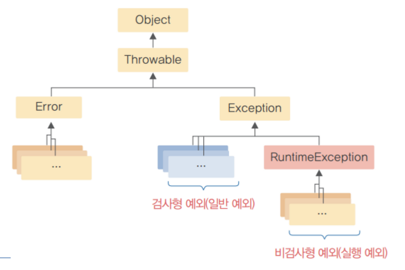
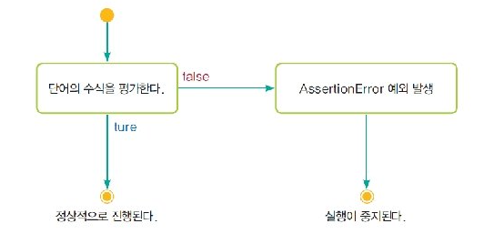

# 오류처리하기
#TIL/Java/

---

## 예외처리1 try-catch
```java
try{
    //예외 발생할수 있는 코드
}catch(예외종류, 참조변수){
    //예외 처리할수 있는 코드
}finally{
    //여기있는 코드는 try 블록이 끝나면 무조건실행
    //ex)자원반납코드
}
```
finally 생략가능

---

## 예외처리2 throws
```java
public void 함수() throws IOException      //예외발생한다고 미리 알려줌
{

}
```
---
## 에외의 종류



Error - 너무심각해서 할 수 있는 방법이 없음 -> 통과

RuntimeException - 프로그래밍 버그이므로 스스로 고쳐야 함 -> 통과

Error나 RuntimeException이 아닌 예외 - 반드시 처리해야 함 -> 검사

---
## 예외 생성하기 throw
형식

throw someThrowableObject;


### 연속적인 예외 발생
```java
try{

}catch (IOExecption e){
    throw new SampleException("다른 예외", e);
}
```

---
## 단언(assertion)
: 믿고 있는 내용을 다시 한 번 확인할때 사용

형식

assert 조건; (조건이 false면 AseertionError 예외 발생)

assert 조건: 수식; (조건이 false면 오류메시지출력 + 변수 x값출력)



이 방법의 문제점은 프로그램을 테스트한 후에도 문장이 항상 프로그램에 존재하기 때문에 실행 속도를 저하시킨다. 따라서 단언 문장은 프로그램을 테스트할 때만 존재하게 하고 제품으로 출시될 때는 삭제할 수 있다.