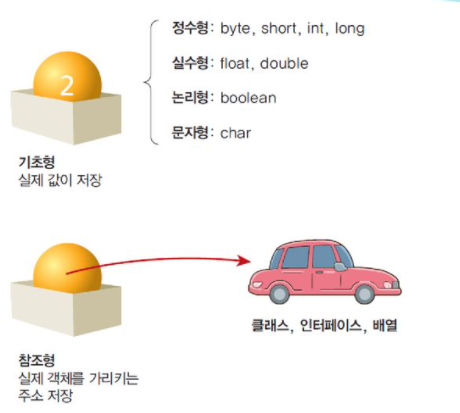

# 자바 기초
#TIL/Java/

---


- 어떤 컴퓨터에서든 실행 가능

### 자바 프로그램 개발 단계
: 바이트코드로 변환시키고 자바가상기계로 해석하여 실행

1. 소스파일 생성
2. 컴파일(바이트 코드로 변환)
3. 클래스 적재와 바이트 코드 검증
4. 실행

### 자바 프로그래밍 기초



이진수의 경우 앞에 0b 

ex) 0b1100

8진수의 경우 앞에 0

ex)016, 018

16진수의 경우 앞에 0x

ex) 0x10, 0x11

부동소수점형 리터럴

일반 표기법|지수표기법
---|---|
146.91|1.4691E+2
0.00081|8.1E-4

double 형이 기본 float 쓰고싶으면 숫자 뒤에 F

ex) float temparature = 12.3F

제곱근 Math.sqrt(9.0) => 3

### 입력

```java
import java.util.Scanner;
Scanner input = new Scanner(system.in)
input.next자료형();
```

next(): 한줄

nextLine(): 한줄(공백 포함)

nextInt: 정수

nextDouble() : 실수

### 난수 생성

```java
Random generator = new Random();
int number = generator.nextInt(100);    // 0~99 사이 난수
```
