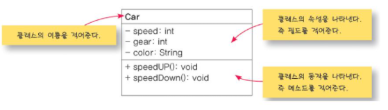
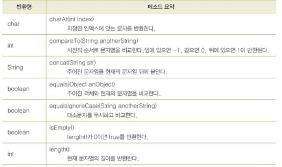
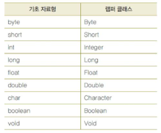

# 클래스, 객체, 메소드
#TIL/Java/

---

다른 언어에선 프로그래머가 직접 객체의 삭제를 책임져야 하지만 자바에서는 자동메모리수거 시스템을사용(쓰레기 수집), 객체가 아무것도 참조하지않으면 쓰레기

메소드의종료
1) } 만날때
2) return 문장 실행


### UML(Unified Modeling Language)
: 객체지향 설계시에 사용하는 일반적인 모델링언어

ex)




## String 클래스 사용

문자열 String 메소드



### 문자열을 수치값음로 변경하는방법

랩퍼클래스(wrapper class) 사용



문자열을 기초 자료형으로 변환할려면 각 랩퍼 클래스의 parseXXX(). 메소드사용

```java
int i = Integer.parseInit("123");   //변수 i에 정수 123 저장

double d = Double.parseDouble("3.141592");  //변수 d에 실수 3.141592 저장
```