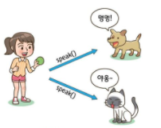

# 클래스와 메소드 심층 탐구, 상속
#Java/TIL/

---

접근자(getter): 필드값 반환하는 메소드

설정자(setter): 필드값 설정하는 메소드

정적변수 or 정적 메소드는 객체 생성할 필요없이 호출가능

정적메소드에서 인스턴스 메소드 호출하는것은 컴파일 오류

## 상속

형식 : 클래스 이름 뒤 extends

```java
class Childclass extends Parentclass        //자식 클래스 또는 서브클래스 / 부모클래스 또는 수퍼 클래스
{

}
```

### 추상메소드
: 완전하게 구현되지 않은 메소드

ex) public abstract void move();

반드시  서브클래스에서 재정의

### 다형성
: 똑같은 문장이더라도 결과값이 다른 것




instanceof 연산자

:객체의 실제타입을 알고 싶을 때
```java
Object obj
if(Obj instanceof Rectangle)        //객체 Obj가 Rectangle이면 실행
{

}
```

종단 클래스: 상속시킬 수 없는 클래스

앞에 final 붙임
```java
final class String{

}
```

종단 메소드: 상속시킬 수 없는 메소드