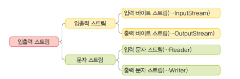
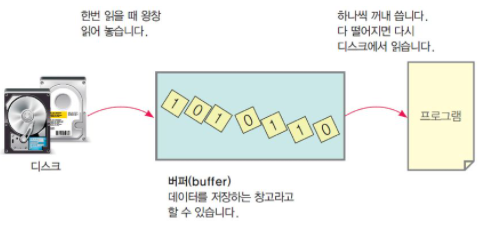
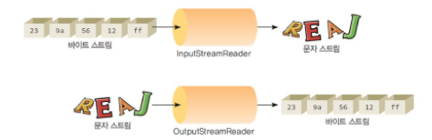

# 파일 입출력
#TIL/Java/

---
스트림으로 데이터를 쓰고 읽을수 있음.

### 스트림종류



스트림에서 읽거나 쓰는동작 종료하였으면 close() 호출하여 스트림 닫아야됨(스트림은 운영체제 자원 많이 소모)

## 바이트 스트림
: 8비트의 바이트 단위로 입출력을 수행하는 스트림
- 파일 입출력 바이트 스트림
    - FileInputStream - 파일 읽기
    - FileOutputstream - 파일 쓰기

## 문자 스트림
: 입출력 단위가 문자인 스트림

- 파일 입출력 문자 스트림
    - FileReader - 파일 읽기
    - FileWriter - 파일 쓰기

### 버퍼 스트림
디스크 접근이나 네트워크 접근은 시간이 매우 오래 걸린다. 그래서 버퍼에 한번에 저장해서 읽거나 쓴다.



```java
inputStream = new BufferedReader(new FileReader("input.txt"));
ouputStream = new BufferedReader(new FileReader("ouput.txt"));
```

### InputStreamReader와 OutputStreamWriter 클래스



### 줄 단위의 입출력
문자 단위가 아니라 한 줄 단위로 입출력해야 되는 경우 BufferedReader, PrinterWriter

### DataInputStream과 DataOutputStream클래스
기초 자료형단위로 데이터를 읽고 쓴다.

UTF-8은 16비트 유니코드 문자들을 8비트 문자들로 변환하기 위한 방법(보통 1 ~ 4 바이트로 변경)

---

## 텍스트 저장하기
텍스트 데이터 읽는 기본 클래스는 InputStreamReader
```java
InputStreamReader in = new InputStreamReader(new FileInputStream("test.dat"), 엔코딩)
```
기본적으로 유니코드 형태로 읽고 엔코딩 표시하면 그 엔코딩을 사용하여 읽음.

파일에서 텍스트 데이터를 읽기 가장 좋은 방법은 Scanner 클래스이다. 하지만 자바SE 5.0 이전에는 Scanner가 없어서 BufferedReader의 readLine() 메소드를 사용했다.

파일에 텍스트 출력 기본 클래스는 PrintWriter
```java
PrintWriter out = new PrintWriter(new FileWriter("test.txt"));
```

### PrintStream 클래스와 PrintWriter 클래스
형식을 가진 출력을 지원하는 스트림 클래스

PrintStream은 바이트 입력을 받아서 텍스트 형태로 출력하는 클래스,

PrintWriter은 문자 입력을 받아서 텍스트 형태로 출력하는 클래스