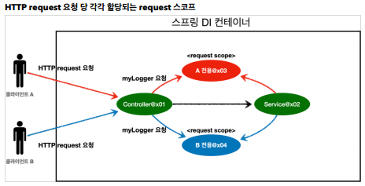

# 빈 스코프
#TIL/Spring/Spring Core/

---
빈이 존재할 수 있는 범위

- 싱글톤: 기본 스코프, 스프링 컨테이너의 시작과 종료까지 유지되는 가장 넓은 범위의 스코프
- 프로토타입: 스프링 컨테이너는 프로토타입 빈의 생성과 의존관계 주입까지만 관여
- 웹 관련 스코프
    - request: 웹 요청이 들어오고 나갈때 까지 유지되는 스코프
    - session: 웹 세션이 생성되고 종료될 때 까지 유지되는 스코프
    - application: 웹의 서블릿 컨텍스트와 같은 범위로 유지되는 스코프

## 프로토타입 스코프
프로토타입 스코프를 스프링 컨테이너에 조회하면 항상 새로운 인스턴스 생성해 반환

- 싱글톤 빈은 스프링 컨테이너 생성시점에 초기화 메서드가 실행 되지만, 프로토타입 스코프의 빈은 스프링 컨테이너에서 빈을 조회할 때 생성
- 스프링 컨테이너가 생성과 의존관계 주입 그리고 초기화 까지만 관여하고 더는 관리하지 않으므로 종료 메서드 호출 x

### 프로로타입 스코프 - 싱글톤 빈과 함께 사용시 문제점 해결방법

- 스프링 컨테이너에 요청

    가장 간단한 방법은 싱글톤 빈이 프로토타입을 사용할 때 마다 스프링 컨테이너에 새로 요청하는 것

직접 필요한 의존관계를 찾는것을 Dependecny Lookup(DL)의존관계 조회(탐색)이라 한다.

- Objectprovider

    지정한 빈을 컨테이너에서 대신 찾아주는 DL 서비스를 제공
    
    - ObjectFactory 상속, 옵션, 스트림처리등 편의 기능 많음
    - 별도의 라이브러리 필요X
    - 스프링에 의존

- JSR-33O Proivder

    지금 딱 필요한 DL 정도의 기능만 제공

    - get() 메서드 하나로 기능 매우 단순
    - 별도의 라이브러리 필요
    - 자바 표준이므로 스프링 아닌 다른 컨테이너에서 사용 가능

---

## 웹 스코프

- 웹 스코프는 웹 환경에서만 동작
- 웹 스코프는 프로토타입과 다르게 스프링 이 해당 스코프의 종료시점까지 관리한다. 따라서 종료 메서드가 호출된다.

### 웹 스코프 종류
- request: HTTP 요청 하나가 들어오고 나갈 때 까지 유지되는 스코프, 각각의 HTTP 요청마다 별도의 빈 인스턴스가 생성되고, 관리된다.
- session: HTTP Session과 동일한 생명주기를 가지는 스코프
- application: 서블릿 컨텍스트(servletContext)와 동일한 생명주기를 가지는 스코프
- websocket: 웹소켓과 동일한 생명주기를 가지는 스코프

---
참고
https://www.inflearn.com/course/%EC%8A%A4%ED%94%84%EB%A7%81-%ED%95%B5%EC%8B%AC-%EC%9B%90%EB%A6%AC-%EA%B8%B0%EB%B3%B8%ED%8E%B8#