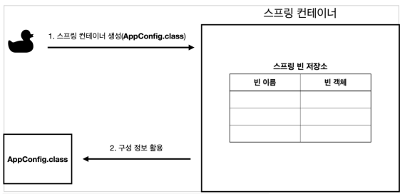
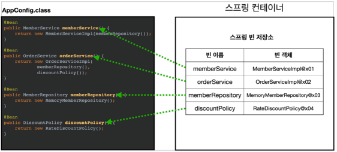
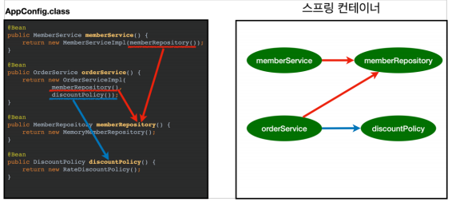
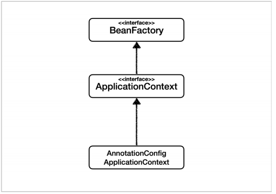
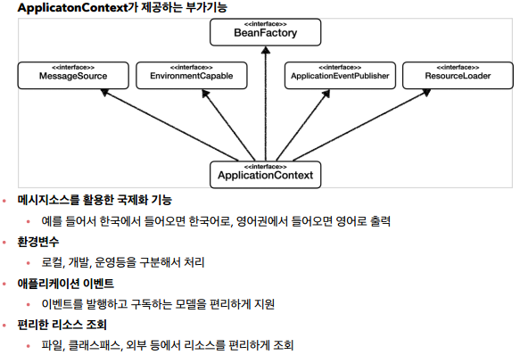
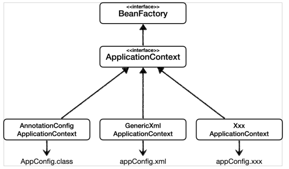
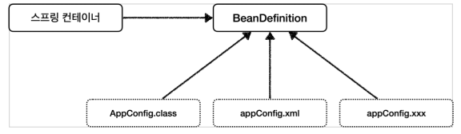

# 스프링 컨테이너와 스프링 빈
#TIL/Spring/Spring Core/

---

## 스프링 컨테이너

```java
//스프링 컨테이너 생성
ApplicationContext applicationContext = new AnnotationConfigApplicationContext(AppConfig.class);
```

- ApplicationContext를 스프링 컨테이너라 한다.
- ApplicationContext는 인터페이스다.
- 스프링 컨테이너는 @Configuration이 붙은 AppConfig를 설정정보로 사용. 여기서 @Bean이라 적힌 메서드를 모두 호출해서 반환된 객체를 스프링 컨테이너에 등록한다. 이렇게 스프링 컨테이너에 등록된 객체를 스트링 빈이라 한다.
- 스프링 빈은 @Bean이 붙은 메서드 명을 스프링 빈의 이름으로 사용.
- 필요한 객체를 스프링 컨테이너를 통해서 필요한 스프링 빈을 찾아야 된다.(applicationContext.getBean() 사용)

### 스프링 컨테이너 생성 과정
1. 스프링 컨테이너 생성



2. 스프링 빈 등록



3. 스프링 빈 의존관계 설정



### 스트링 빈 조회
- getBean(빈이름, 타입);
- getBean(타입);

부모타입으로 조회하면 자식타입도 함께 조회

## BeanFactory와 ApplicationContext



### BeanFactory
- 스프링 컨테이너 최상위 인터페이스
- 스프링 빈 관리하고 조회하는 역활 담당
- getBean() 제공

### ApplicationContext
- BeanFactory 기능 모두 상속받아서 제공 + 많은 부가 기능

### ApplicationContext가 제공하는 부가기능



## 다양한 설정 형식 지원 - 자바코드, XML
- 스프링 컨테이너는 다양한 형식의 설정 정보를 받아드릴 수 있게 유연하게 설계되어 있다(자바코드, XML, Groovy 등등)



### 애노테이션 기반 자바 코드 설정
- AnnotationConfigApplicationContext클래스를 사용하여 자바코드로된 설정 정보를 넘기면 된다.

### XML 설정
- GenericXmlAppliciationContext를 사용하면서 xml 설정 파일을 넘기면 된다.

### 스프링 빈 설정 메타 정보 - BeanDefinition
- 스프링은 어떻게 다양한 설정형식 지원? 그 중심에는 BeanDefinition이라는 추상화가 있음.



---
참고
https://www.inflearn.com/course/%EC%8A%A4%ED%94%84%EB%A7%81-%ED%95%B5%EC%8B%AC-%EC%9B%90%EB%A6%AC-%EA%B8%B0%EB%B3%B8%ED%8E%B8#