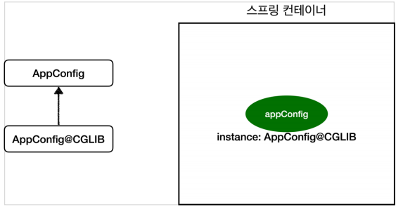

# 싱글톤 컨테이너
#TIL/Spring/Spring Core/

---
## 싱글톤 패턴
: 클래스의 인스턴스가 딱 1개만 생성 되는 것을 보장하는 디자인 패턴.

### 싱글톤 패턴 문제점
- 싱글턴 패턴을 구현하는 코드 자체가 많이 들어간다.
- 의존관계상 클라이언트가 구체 클래스에 의존한다 -> DIP를 위반한다.
- 클라이언트가 구체 클래스에 의존해서 OCP 원칙을 위반할 가능성이 높다.
- 테스트하기 어렵다.

## 싱글톤 컨테이너
: 싱글톤 패턴의 문제점을 해결하면서 객체 인스턴스를 싱글톤으로 관리

스프링 컨테이너는 싱글톤 컨테이너 역활을 함.

### 싱글톤 방식의 주의점
- 여러 클라이언트가 하나의 같은 객체 인스턴스를 공유하기 때문에 싱글톤 객체는 상태를 유지(Stateful)하게 설계하면 안된다.
- 무상태(stateless)로 설계해야 한다
    - 특정 클라이언트에 의존적인 필드가 있으면 안된다.
    - 특정 클라이언트가 값을 변경할 수 있는 필드가 있으면 안된다.
    - 가급적 읽기만 가능해야 한다.
    - 필드 대신 자바에서 공유 되지 않는 지역변수, 파라미터, ThreadLocal 사용

Appconfig에서 @Configuration이 Appconfig@CGLIB 이용해 싱글톤 보장하게 한다.

@Bean 만 사용해도 스트링 빈 등록되지만 싱글톤 보장X

---
참고
https://www.inflearn.com/course/%EC%8A%A4%ED%94%84%EB%A7%81-%ED%95%B5%EC%8B%AC-%EC%9B%90%EB%A6%AC-%EA%B8%B0%EB%B3%B8%ED%8E%B8#