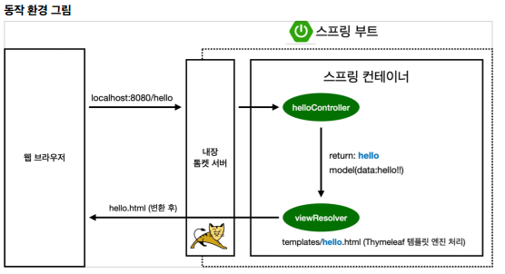

# Project Setting
#TIL/Spring/Spring Introduction/

---
스프링 부트 스타터 사이트
https://start.spring.io

## 라이브러리 살펴보기
Gradle은 의존관계가 있는 라이브러리를 함께 다운로드

### 스프링 부트 라이브러리
- spring-boot-starter-web
    - spring-boot-starter-tomcat: 톰캣(웹서버)
    - spring-webmvc: 스프링 웹 MVC
- spring-boot-starter-thymeleaf: 타임리프 템플릿 엔진(View)
- spring-boot-starter(공통): 스프링 부트 + 스프링 코어 + 로깅
    - spring-boot
        - spring-core
    - spring-boot-starter-logging
        - logback, slf4j

### 테스트 라이브러리
- spring-boot-starter-test
    - junit: 테스트 프레임워크
    - mockito: 목 라이브러리
    - assertj: 테스트 코드를 좀 더 편하게 작성하게 도와주는 라이브러리
    - spring-test: 스프링 통합 테스트 지원

---
## View 환경설정

컨트롤러에서 리턴 값으로 문자를 반환하면 viewResolver가 화면을 찾아서 처리한다.

---

## 빌드하고 실행하기

#### 콘솔로 이동
1. ./gradlew build
2. cd build/libs
3. java -jar hello-spring-0.0.1-SNAPSHOT.jar
4. 실행확인

