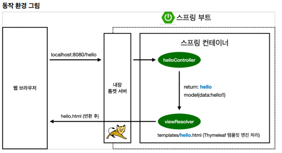
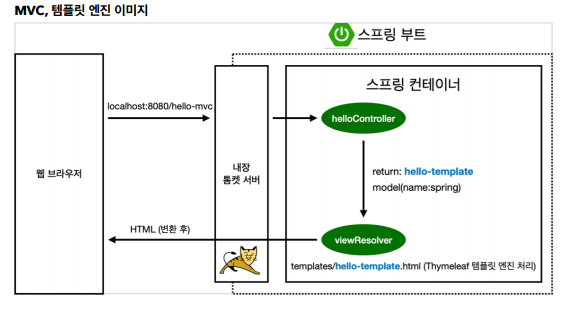
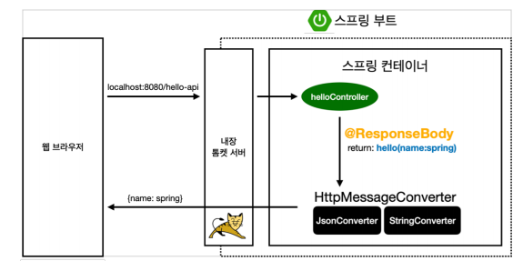

# 스프링 웹 개발 기초
#TIL/Spring/Spring Introduction

---
## 정적 컨텐츠

톰켓 서버에서 hello-state 관련 컨트롤러 확인후 없으면 static에서 hello-static.html 그대로 웹 브라우저로 처리

---

## MVC와 템플릿 엔진

- MVC: Model, View, Controller

컨트롤러에서 리턴 값으로 문자를 반환하면 viewResolver가 화면을 찾아서 처리

---

## API

- @ResponseBody를 사용
    - HTTP의 BODY에 문자 내용을 직접 반환
    - viewResolver 대신에 HttpMessageConverter가 동작
    - 기본 문자처리: StringHttpMessageConverter
    - 기본 객체처리: MappingJackson2HttpMessageConverter

