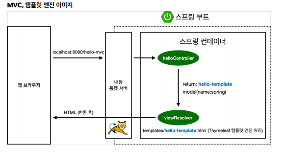
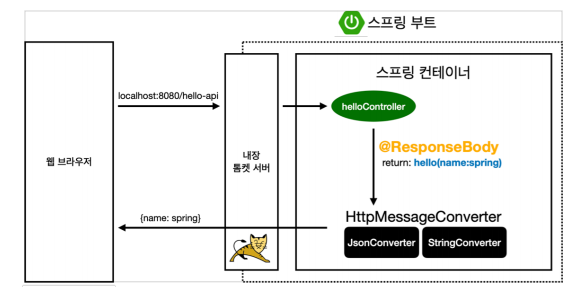
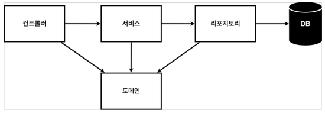
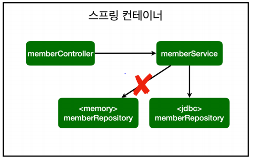
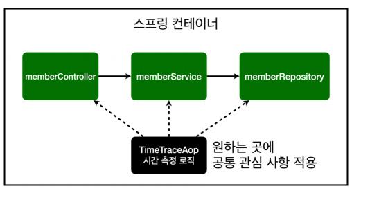
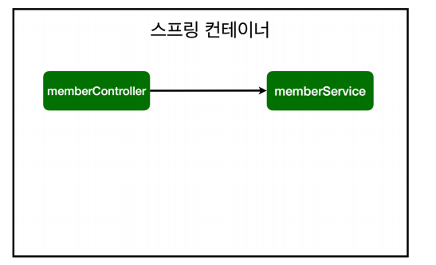
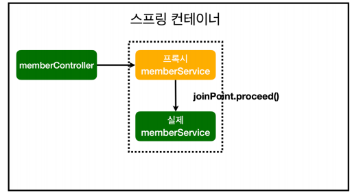

# 스프링 웹 개발 기초
#TIL/Spring/Spring Introduction

---
@ 스프링 배우기전 간단한 Introduction

## 정적 컨텐츠

톰켓 서버에서 hello-state 관련 컨트롤러 확인후 없으면 static에서 hello-static.html 그대로 웹 브라우저로 처리

---

## MVC와 템플릿 엔진

- MVC: Model, View, Controller

컨트롤러에서 리턴 값으로 문자를 반환하면 viewResolver가 화면을 찾아서 처리

---

## API

- @ResponseBody를 사용
    - HTTP의 BODY에 문자 내용을 직접 반환
    - viewResolver 대신에 HttpMessageConverter가 동작
    - 기본 문자처리: StringHttpMessageConverter
    - 기본 객체처리: MappingJackson2HttpMessageConverter

---

## 일반적인 웹 애플리케이션 계층 구조

- 컨트롤러: 웹MVC의 컨트롤러 역활
- 서비스: 핵심 비즈니스 로직 구현
- 리포지토리: 데이터베이스에 접근, 도메인 객체를 저장하고 관리
- 도메인: 비즈니스 도메인 객체

---

## 스트링 빈과 의존관계

컨트롤러가 서비스와 리포지토리를 사용할수 있게 의존관계를 준비

스프링 빈을 등록하는 2가지 방법
1. 컴포넌트 스캔과 자동의존관계설정

    @Component 애노테이션이 있으면 스트링 빈으로 자동 등록된다.
    @Component
    - @Controller
    - @Serivce
    - @Repository

    참고: 스프링은 스프링 컨테이너에 스프링 빈을 등록할 때, 기본으로 싱글톤으로 등록.(유일하게 하나만 등록) 따라서 같은 스프링 빈이면 모두 같은 인스턴스다.

2. 자바코드로 직접 스프링 빈 등록

    @Configuration으로 직접 등록 (@Bean)

참고: DI에는 필드 주입, setter 주입, 생성자 주입 이렇게 3가지 방법이 있다. 의존관계가 실행중에 변하는 경우는 거의 없으니 생성자 주입을 권장.

참고: 실무에서는 주로 정형화된 컨트롤러, 서비스, 리포지토리 같은 코드는 컴포넌트 스캔을 사용. 그리고 정형화 되지 않거나, 상황에 따라 구현 클래스를 변경해야 하면 설정을 통해 스프링 빈으로 등록한다.

---

## 스프링 DB 접근 기술

### H2 데이터베이스

개발이나 테스트 요도로 가볍고 편리한 DB, 웹화면 제공

https://www.h2database.com

### 순수 Jdbc

- 개방 폐쇄 원칙(OCP, Open-Closed Principle)
    - 확장에는 열려있고, 수정, 변경에는 닫혀있다.
- 스프링의 DI(Dependencies Injection)을 사용하면 기존 코드를 전혀 손대지 않고, 설정만으로 구현클래스를 변경할 수 있다.

통합테스트

@SpringBootTest: 스프링 컨테이너와 테스트를 함께 실행한다.

@Transactional: 테스트 케이스에 이 애노테이션이 있으면, 테스트 시작 전에 트랙잭션으 ㅣ시작하고, 테스트 완료후에 항상 롤백한다. 이렇게 하면 DB에 데이터가 남지 않으므로 다음 테스트에 영향을 주지 않는다.

### JdbcTemplate
: 스프링 JdbcTemplate과 MyBatis 같은 라이브러리는 JDBC API에서 본 반복 코드를 대부분 제거해준다. 하지만 SQL은 직접 작성해야 한다.

### JPA
-  JPA는 기존의 반복코드는 물론 기본적인 SQL도 직접 JPA가 직접 만들어 실행(쿼리작성X)
- JPA를 사용하면 SQL과 데이터 중심의 설계에서 객체 중심의 설계로 패러다임을 전환할 수 있다.
- JPA를 사용하면 개발 생산성을 크게 높일 수 있다.

### 스프링 데이터 JPA
: 스프링 부트와 JPA만 사용해도 개발 생산성이 정말 많이 증가하고, 개발해야할 코드도 확연히 줄어든다. 여기에 스프링 데이터 JPA르 사용하면 리포지토리에 구현 클래스 없이 인터페이스 만으로 개발을 완료할 수 있다. 그리고 반복 개발해온 기본 CRUD 기능도 스프링 데이터 JPA가 모두 제공.

- 스프링 데이터 JPA가 Repository를 스프링 빈으로 자동 등록해준다.

참고: 실무에서는 JPA와 스프링 데이터 JPA를 기본적으로 사용하고, 복잡한 동적 쿼리는 Querydsl이라는 라이브러리를 사용하면 된다. 이조합으로 해결하기 어려운 쿼리는 JPA가 제공하는 네이티브 쿼리를 사용하거나 , JdbcTemplate을 사용

---

## AOP(Aspect oriented programming)

AOP가 필요한 상황

- 모든 메소드의 호출시간 측정

### 스프링의 AOP 동작 방식

AOP 적용 전 의존관계

AOP 적용 후 의존관계

---
참고
https://www.inflearn.com/course/%EC%8A%A4%ED%94%84%EB%A7%81-%EC%9E%85%EB%AC%B8-%EC%8A%A4%ED%94%84%EB%A7%81%EB%B6%80%ED%8A%B8#