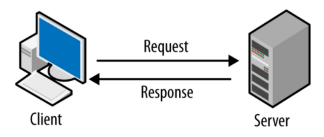

# JSON
#etc/JSON

---



Client 와 Server 통신은 ajax, XMLHttpRequest, fetch() API로 주고 받을수 있다.

XML,JSON으로 넘길 수 있는데 XML은 불필요한 형식이 많아 사이즈도 커지고 가독성도 좋지않아 XML대신에 요즘은 JSON을 많이 씀

## JSON
- simplest data interchange format
- key-value pairs
- used for serialization and transmission of data
- independent programming language and platform


Object  --serialize--> JSON(String)

Object  <--deserialize-- JSON(String)

## Object to JSON
JSON.Stringify

```js
json = JSON.stringify(['apple', 'banana']);

//=> ["apple", "banana"]
```

```js
const rabbit = { name
    name: 'tori',
    color: 'white',
    size: null,
    birthDate: new Date(),
    jump: () => {
        console.log(`${name} can jump`);
    }
}

json = JSON.stringify(rabbit);

//=> {"name":"tori","color":"white", "size": null, "birthDate":"2021:09:29T21:29:32.220Z"}


// 원하는것만 넘기기도 가능
json = JSON.stringify(rabbit, [ 'name', 'color']);

//=> {"name":"tori","color":"white"} 

//콜백함수로 세밀하게 넘기기도 가능
json = JSON.stringify(rabbit, (key, value) => {
    return key === 'name' ? 'change' : value;
}
 
//=> {"name":"change","color":"white", "size": null, "birthDate":"2021:09:29T21:29:32.220Z"}
```

## jSON to Object
JSON.parse

```js
json = JSON.stringify(rabbit);
const obj = JSON.parse(json)

// => {name:"change",color:"white", size: null, birthDate:"2021:09:29T21:29:32.220Z"}

//콜백함수로 세밀히 받기 가능
const obj = JSON.parse(json, (key, value) => {
    return key === 'birthDate' ? new Date(value) : value;	
});

//  => {name:"change",color:"white", size: null, Date: Tue September 2021 21:43:34 ~}
```
