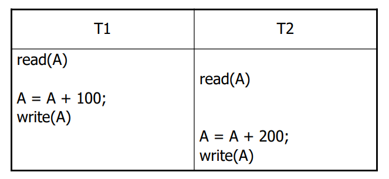
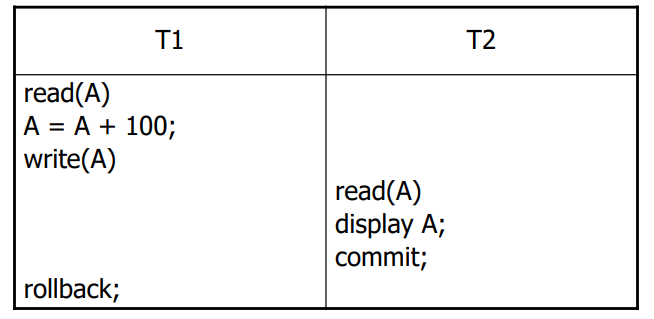
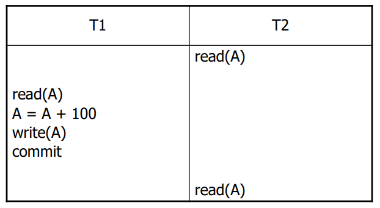
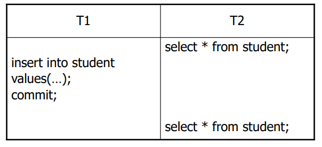
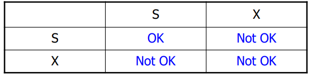
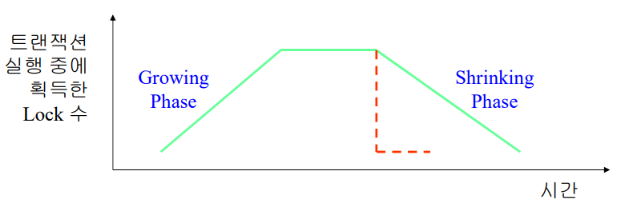
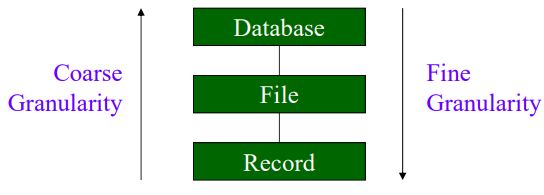
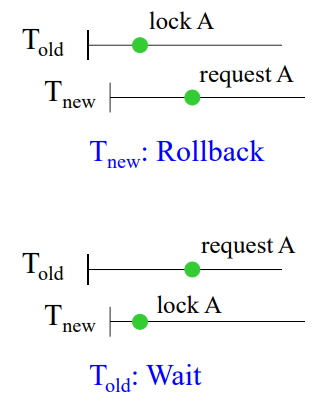
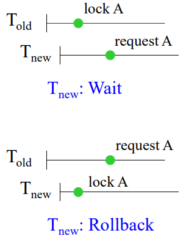

# Concurrency Control
#데이터 베이스/Concurrency Control

---
## Concurrency Control의 목적
- 동시에 실행되는 트랜잭션 제어
- 데이터베이스의 일관성(Serializability) 유지

Concurrency Control이 없을 경우 문제점
- Lost Update
- Dirty Read
- Unrepeatable Read
- Phantom Read

### Lost Update

### Dirty Read

### Unrepeatable Read

### Phantom Read

## SQL의 Transaction Isolation Level
- READ UNCOMMITED
    - Phantom read/Unrepeatable read/Dirty read 허용
- READ COMMITED
    - Phantom read/Unrepeatable read만 허용
- REPEATABLE READ
    - Phatom read만 허용
- SERIALIZABLE
    - 모두 허용 안됨

## Concurrency Control의 종류
Concurrency Control의 법칙
- 동시에 실행되는 트랜잭션의 정확성 유지
- 트랙잭션의 동시 실행은 순차 실행보다 좋은 성능 보장

Concurrency Control의 종류
- Locking
- Timestamp Ordering
- Optimistic Concurrency Control

### Locking
Lock이란?
- 데이터에 대한 액세스 권한
- Lock을 가지고 있는 트랜잭션만이 데이터 액세스

Lock Modes
- Share(S) Lock: 데이터를 read할 때 사용
- Exclusvie(X) Lock: 데이터를 write할 때 사용

### Locking Rule
Lock을 획득하는 시점
- 데이터를 액세스하기 전에 Lock 요청
- Conflict mode의 Lock이 이미 걸려 있을 경우
    - Lock이 해제될 때까지 대기 <- Deadlock 발생 가능
    - 여러 트랜잭션이 대기 중일 때 < Starvation 발생 가능

Lock을 해제하는 시점
- 트랜잭션이 완료할 때까지 보유(two-phase rule)

### Two Phase Lockikng (2PL)
Two phase Locking Protocol
- Unlock을 한 후 Lock 요청 불가
    - Growing Phase: Lock을 요청하는 단계
    - Shrinking Phase: Unlock 단계

## Multiple Granularity Locking
Lock
- Fine granularity: High concurrency, High overhead
- Coars granularity: Low concurrency, Low overhead

Multiple Granularity Locking (MGL)
- 목적: High Concurrency with Low Overhead
- Explicit Locking, Implicit Locking, Intention Locking

### Intention Mode
- Intention Shared (IS) Mode
    - 하위 레벨에서 Explicit S mode의 lock 보유
- Intention Exclusive (IX) Mode
    - 하위 레벨에서 Explicit X mode의 lock 보유
- Shared and Intention Exclusive (SIX) Mode
    - Explicit S mode의 lock 보유
    - 하위 레벨에서 Explicit X mode의 lock 보유

### Locking Protocol of MGL
Lock의 획득과 해제
- Lock의 획득: Root -> Leaf
- Lock의 해제: Leaf -> Root

Lock Mode
- Explicit S lock를 요청할 노드의 모든 상위 노드: IS
- Explicit X lock를 요청할 노드의 모든 상위 노드: IX
- SIX lock를 요청할 노드의 모든 상위 노드: IX

## Deadlock Handling
Deadlock 해결 방법
- Deadlock Prevention
- Deadlock Detection and Resolution

### Deadlock Prevention
Deadlock이 발생할 가능성을 봉쇄

종류
- 모든 lock을 한번에 요청 -> 거부될 경우 모두 해제
- 데이터에 순서 부여 -> 순서대로 lock 요청
- Preemption: wait-die, wound-wait

Wait-Die
- new는 항상 죽고 old는 기다린다

Wound-Wait
- new는 기다리고 old는 쫒아낸다

### Deadlock Detection
Deadlock 조건: cycle 발생

Resolution
- Selection of a victim transaction
- Victim transaction의 rollback

## Other Concurrency Controls
TimeStamp Ordering
- 트랜잭션과 데이터에 타임스태프 할당
- 트랜잭션의 타임스탬프 순서로 데이터 액세스
- 순서를 만족하지 못할 경우, 트랜잭션 철회

Optimistic Concurrency Control
- 트랜잭션들간에 충돌이 없다고 가정
    - Local data에 대해 트랜잭션 실행 후, 검증
    - 검증의 결과 충돌이 발생할 경우, roll back
    - 충돌이 발생하지 않을 경우, 실행 결과를 저장
- 대부분의 트랜잭션이 read-only일 경우, 최선의 선택