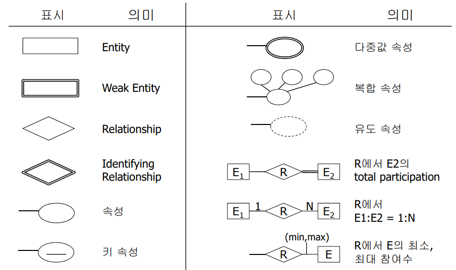

# ER Model
#데이터베이스/ER Model

---
## 개념적 설계의 소개
- 특정 체계의 정보 요구사항을 구성하는
    - 개체와 관계, 그리고 속성들을 인식
    - 도형화/명세화 <- Entity Relationship Diagram
- 개념적 설계의 필요성
    - 데이터 독립성 제공을 위한 안정된 자료구조의 창출
    - 특정 DBMS에 적합한 데이터 모델로의 변환 용이
    - ER 모델과 관련명세서를 통한 산출물의 이해도 증진

## 논리적 설게
논리적 설계의 목적
- 개념적 스키마(ER모델) -> DBMS의 논리적 스키마로 변환

개념적 설계와 논리적 설계의 차이
- 개념적 설계 - 스키마의 표현력과 완전성을 추구
- 논리적 설계 - 논리적 모델이 제공하는 자료 구조와 제약사항을 효율적으로 이용

논리적 설계의 접근 방향
- ER 다이아그램을 단순한 ER 다이아그램으로 변환
- 단순한 ER 다이아그램을 DBMS의 논리적인 모델로 변형

## 물리적 설계
논리적 스키마를 이용하여 효율적인 물리적인 데이터베이스를 구성하는 일

### Entity, Attribute
- Entity: DB에서 표현해야하는 핵심적인 사물이나 개념
- Attribute: Entity를 표현하기 위해 사용하는 속성
- 각 속성은 value set(또는 data type, domain)을 갖는다.

### 속성의 분류
- 단순 속성: 더 이상의 작은 요소로 분할할 수 없는 값
- 복합 속성: 몇 개의 더 작은 속성들로 분할 가능한 속성
- 단일 값 속성: 하나의 값만 가질 경우
- 다중 값 속성: 여러 개의 값을 가질 경우
- 복합-다중 값 속성의 혼합도 가능
- Null 속성: 값이 입력되지 않은 속성
- 유도 속성: 다른 속성의 값을 이용하여 유도할 수 있는 속성

### Entity Type, Entity Set
Entity Type
- 동일한 속성들을 갖는 개체들의 집합
- 이름과 속성 리스트를 갖는다 <- schema

Entity Set
개채들의 집합 (set of instances)

## Key Attribute
정의
- Entity set에 포함된 특정 개체를 식별하는 속성들의 집합
- 유일성
- 최소성

슈퍼키(Super Key)
- 유일성을 만족하는 속성들의 집합
- 군더더기 속성들이 포함될 수 있음

후보키(Candidate Key)
- 군더더기가 없는 슈퍼 키(유일성 + 최소성)

주 키(Primary Key)
- 후보 키 중의 하나를 선택

## Entity Type을 그리기
- Entity type - 사각형으로 표시
- Attribute - 타원으로 표시
    - 각 속성은 entity type에 연결
    - 복합 속성은 트리 형태로 표시
    - 키 속성은 밑줄로 표시
    - 다중값 속성은 겹선의 타원으로 표시

## Relationship and Relationship Type
Relationship
- 둘 이상의 서로 다른 개체들을 연결

Relationship Type
동일한 타입의 관계들을 묶는 개념

### 이진 관계에 대한 제약 조건들
- Cardinality Ratios(최대 참여 수 조건)
- Participation Constraint(최소 참여 수 조건)
    - Total participation
        - 모든 개체가 관계에 참여해야할 경우
    - Partial participation
        - 개체 집합의 일부 개체는 관계에 참여하지 않을 경우

### Relationship의 Attribute
- Relationship도 속성을 가질 수 있다.
- Relationship의 cardinality ratio에 따른 고려 사항
    - 1:1이나 1:n 관계에서는 개체로 속성 이동 가능
    - n:n 관계의 경우에는 relationship에 속성 포함

## Weak Entity Type
- 키 속성이 없는 entity <-> Strong entity
- Owner(Identifying) entity type
    - Weak entity set의 특정 개체를 유일하게 식별하기 위한 키를 제공하는 entity type
- Identifying relationship
    - Weak entity와 owner entity를 연결하는 관계
- Discriminator(구별자)
    - 동일한 owner entity에 관련된 weak entity들을 식별할 때 사용하는 속성
    - partial key라고도 부름
    