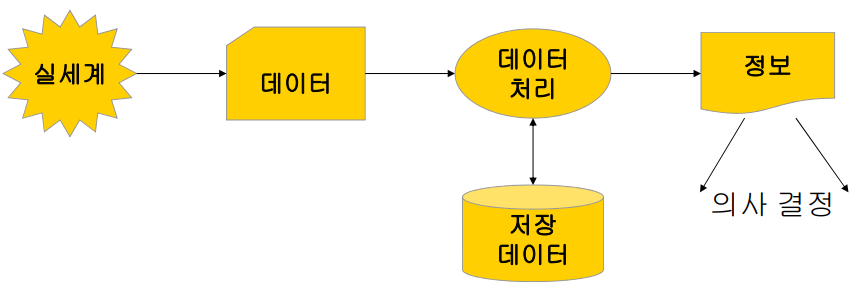
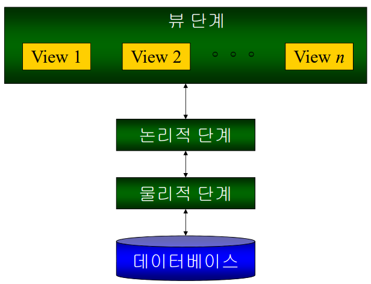
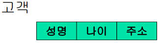
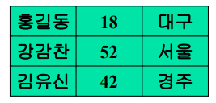

# Introduction
#데이터베이스/Introduction

---
## 정보 시스템
데이터를 저장, 조직하여 정보를 제공하는 시스템

- 데이터: 현실세계에서 단순한 관찰이나 특정을 통해 수집된 사실이나 값
- 정보: 데이터의 해석이나 상호간의 관게를 분석하여 획득한 지식

## 데이터베이스
정보 시스템을 구현하는 두 가지 방법
- 파일 시스템을 이용한 정보 처리
- 데이터베이스를 이요한 정보 처리

### 파일 처리 시스템의 단점
- 데이터 중복성
    - 동일 의미의 데이터들 사이의 불일치
    - 저장 공간의 낭비 및 비싼 갱신 비용
    - 동일 데이터의 보안 문제
- 데이터 종속성
    - 물리적 구조가 변경되면 프로그램도 변경

### 데이터베이스의 특성
- 실시간 접근성
- 계속적인 변화
- 동시 공유
- 내용에 의한 참조

## 데이터베이스 관리 시스템(Database Management System)
응용 프로그램이 데이터베이스를 공유할 수 있도록 관리해주는 시스템 소프트웨어

DBMS의 목적
- 사용의 편이성: 사용자가 시스템 내부에 대한 지식이 없어도 원하는 데이터를 쉽게 읽고 고칠 수 있도록
- 관리의 효율성: 데이터를 효율적으로 관리하여 성능과 정확성을 보장할 수 있도록

### DBMS의 필수 기능
- 정의 기능
    - 데이터베이스 구조를 정의
    - 논리적 구조, 물리적 구조, 두 구조 사이의 매핑 정의
    - Data Definition Language(DDL)에 의해 지원
- 조작 기능
    - 데이터 처리 기능(검색, 갱신, 삭제, 추가)
    - Data Manipulation Language(DML)에 의해 지원
- 제어 기능
    - 데이터에 대한 "정확성"과 "안정성" 유지
    - 트랜잭션, 동시성 제어, 데이터 무결성, 보안 등
    - Data Control Language(DCL)에 의해 지원

### DBMS의 장점
- 데이터 독립성 제공
- 데이터의 공용 -> 데이터 중복 최소화
- 데이터의 일관성 유지
- 데이터의 무결성 유지
- 데이터의 보안 보장

### DBMS의 단점
- 운영비의 증가
- 자료 처리방법의 복잡화
- 성능상의 문제

### 데이터 추상화의 단계
- 뷰 단계
    - 실제 사용자가 보는 데이터베이스의 관점
- 논리적 단계
    - 저장된 데이터의 내용 및 데이터들간의 관게 기술
    - 데이터 베이스 관리자(DBA)에 의해 사용됨
- 물리적 단계
    - 데이터가 실제로 저장되는 방법 기술

### 스키마와 인스턴스
스키마
- DB의 구조(골격)

인스턴스
- 특정 시점에서 DB의 상태

### 데이터 독립성
데이터의 논리적 구조나 물리적 구조가 변경되더라도 응용 프로그램이 영향 받지 않도록 하는 성질

---

## 데이터 모델
다음을 표현하는 개념적인 도구
- 데이터
- 데이터들간의 관계
- 데이터의 의미
- 데이터에 주어진 제약 조건 등

데이터 모델의 세가지 종류
- 개념적 모델
- 논리적 모델
- 물리적 모델

### 개념적 모델
개념적 데이터베이스 설계 단계에서 주로 사용
- 개체 관계 모델: 개체와 관계로 실세계 표현
- 객체 지향 모델

### 논리적 모델
특정 DBMS에 의해 구현되는 것을 가정
- 네트워크 모델: 관계를 Record간의 link로 표현(n:n) <- 그래프
- 계층형 모델: 관계를 Record간의 link로 표현(1:n) <- 트리
- 관계형 모델: Entity와 Relationship이 모두 테이블 형태로 표현
- 객체 지향형 모델: 객체지향개념을 데이터베이스에 구현
- 객체 관계형 모델: 관계형 모델의 보편성과 객체 지향형 모델의 고급 기능 

### 물리적 모델
물리적 데이터베이스의 구조 기술

## 데이터베이스 언어
- 데이터 정의어(Data Definition Language: DDL)
    - 데이터베이스의 스키마를 정의/수정/삭제 하는 용도
- 데이터 조작어(Data Manipulation Language: DML)
    - 레코드에 대한 검색/삽입/수정/삭제 지원
- 데이터 제어어(Data Control Language: DCL)
    - 트랜잭션 관리, 보안 관리

### 저장 시스템
데이터베이스에 저장된 데이터와 응용 프로그램간의 인터페이스 제공

### 트랜잭션 관리
트랜잭션?
- 논리적인 작업의 단위

트랜 잭션의 ACID속성
- 원자성(Atomicity): All or Nothing
- 일관성(Consistency): 정확성
- 고립성(Isolation): 중간결과가 노출 x
- 영구성(Durability): 영원히 저장

온라인 트랜잭션 처리(On-Line Transaction Processing: OLTP)
- 많은 수의 단순한 트랜잭션들이 동시에 실행되는 응용
    - ex) 인터넷 뱅킹, 주식 거래, 철도 예약 등

## 데이터베이스 사용자
응용 프로그래머
- DML을 이용하여 데이터베이스 응용 프로그램 작성

일반 사용자
- 응용 프로그램 이용

데이터베이스 관리자
- DCL, DDL을 이용해 데이터 베이스 정의
- 데이터베이스 관리와 운영을 책임

### 데이터베이스 관리자(DBA: Database Administrator)
데이터베이스 시스템의 관리 운영에 대한 모든 책임을 가지고 있는 사람
- 데이터 베이스 설계와 운영
- 행정 관리 및 불평 해결
- 시스템 감시 및 성능 분석

