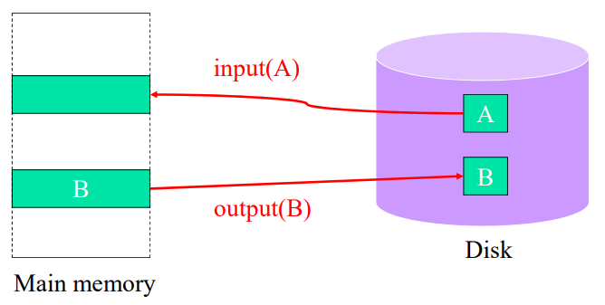
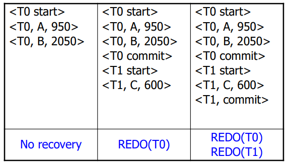
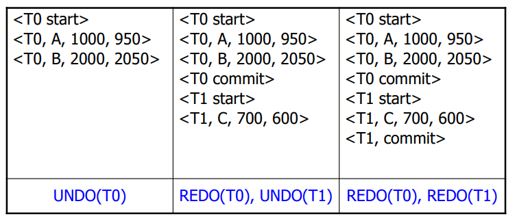
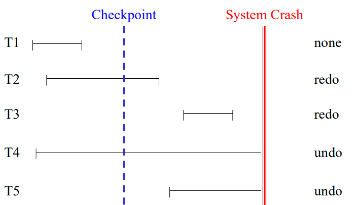

# Recovery System
#데이터 베이스/Recovery System

---
## Failure Classification
Transaction Failure
- Logical Error: bad input, overflow, data not found ...
- System Error: deadlock

System Crash
- DBMS나 OS의 실행 중지 (예: 정전)
- Volatile memory의 내용 파손

Media Failure
- Nonvolatile memory의 내용 파손

## Storage Structur
Storage Types
- Volatile storage
    - 정전과 같은 system crash 발생시 내용 파손
    - 예: Main Memory, Cache memory
- Nonvolatile storage
    - System crash가 발생해도 내용 유지
    - 예: Hard disk, Magnetic tape
- Stable storage
    - 어떤 형태의 failure가 발생해도 내용 유지
    - Replication에 의해 S/W적으로 구현

## Data Access

Read(X)와 Write(X)
- Read(X, x): X를 읽어서 지역 변수 x에 할당
    - X를 저장한 버퍼 블록 B(x)가 없을 경우, input(B(x))
    - B(x) 블록에서 X를 읽어 지역 변수 x에 할당
- Write(X,x): 지역 변수 x의 값을 X에 할당
    - X를 저장한 버퍼 블록 B(x)가 없을 경우, input(B(x))
    - x의 값을 B(x) 블록의 X에 할당
- 주의: Outut != Write
    - System crash 발생시 recovery 필요
    - Synchronous IO의 문제점? slow

## Buffer Policy vs. Recovery Operations
Buffer Policy
- 실행 중인 트랜잭션의 결과가 디스크에 기록 가능?
    - STEAL, ~STEAL
- 완료한 트랜잭션의 결과를 반드시 디스크에 기록?
    - FORCE, ~FORCE

Recovery Operation (고장 발생후)
- UNDO: 실행 중인 트랜잭션의 결과를 디스크에서 삭제
- REDO: 이전에 완료한 트랜잭션을 재 실행

-|STEAL|~STEAL
---|---|---
FORCE|UNDO|No Recovery
~FORCE|UNDO, REDO|REDO

## Log-Based Recovery
Update Log Record
- Transaction이 update 연산을 실행할 때마다 생성
- 구조
    - Transaction 식별자, Data 식별자
    - Old value, New value

### Deferred DB Modification
특성
- 트랜잭션 완료 전에 갱신 내용을 DB에 반영하지 않는다(~STEAL)
- UNDO 불필요 - Log에 old value 기록할 필요 없음

### Immediate DB Modification
특성
- 트랜 잭션 완료 전에 갱신 내용을 DB에 반영할 수 있다(STEAL)
- UNDO와 REDO 모두 필요 - Log에 old value 기록

### Checkpoints
Checkpoint Steps
- 로그 버퍼의 모든 로그 레코드들을 로그 디스크에 기록
- 갱신된 데이터 버퍼 페이지들을 디스크에 기록
- <checkpoint> 로그 레코드들을 로그 디스크에 기록

### Checkpoint and System Restart

## ARIES
A Transaction Recovery Method
- Fine-Granularity Locking 지원
- Partial Rollback 지원
- Write Ahead Logging 이용

ARIES의 기본 개념
- Log Sequence Number (LSN) 이용
- Index에 대한 Logical Undo 지원
- Flexible Buffer Management: Steal & Not Force
- Fuzzy Checkpoint 지원

### Data Structures of ARIES
Log Record
- Log Sequence Number (LSN)
- Type: Update, Commit, Compensation
- Transaction Identifier
- Previous LSN (PrevLSN)
- Record Identifier
- Data: Value Logging / Opreation Logging

Data Page
- Data + PageLSN

Transaction Table
- Transaction Identifier
- State: Prepared ('P') or Un-prepared ('U')
- LastLSN
- UndoNxtLSN

Dirty Pages Table
- Page Identifier
- RecoveryLSN
    - Page가 dirty 상태로 변환될 때의 LSN
    - Page를 회복하기 위한 로그의 starting point

### Normal Processing
Page의 record를 update하는 과정
- Record에 대한 lock 요청 & 승인
- Page를 buffer에 fix & 'X' mode로 latch
- Record update
- Log record를 생성하고, in-memory log list에 추가
- Log의 LSN을 Page의 PageLSN 필드에 저장
- Page latch 해제 & unfix (fix_count--)

Transaction Commit
- 'commit' log 생성, log force, lock release

Fuzzy Checkpoint
- Begin_Checkpoint log record 기록
- End_Checkopoint log record 생성
    - Transcation Table, DPT, ...
- End_Checkpoint log record 기록
- Master record에 Begin_Checkpoint log의 LSN 저장

### Restart Processing
RESTART(Master-Addr)
1. Analysis(Master-Addr, Trans-Table, DPT, RedoLSN)
2. Restart-Redo(RedoLSN, Trans-Table, DPT)
3. Buffer pool DPT = DPT;
4. Restart-Undo(Trans-Table)
5. Require locks for prepared transactions;
6. Checkpoint()
7. RETURN

## Media Recovery
- Recovery from a disk crash
- Media Recovery: archival Dump + Redo LOGs