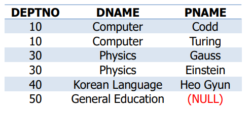

# SQL
#데이터베이스/SQL

---
## SQL (By Oracle)

### 특정 필드만 출력
```sql
SELECT sid, sname
FROM student;
```

### 테이블의 모든 열 출력
```sql
SELECT *
FROM student;
```

### DISTINCT를 이용하여 중복 제거
```sql
SELECT distinct deptno
FROM student;
```

### 특정 필드 이름을 변경하여 출력
학생 테이블에서 deptno 를 department로 바꿔 출력
```sql
SELECT sid, sname, deptno department
FROM student;
```

### 열 결합하여 출력
학번과 이름을 합치고 열 이름을 student로 출력
```sql
SELECT sid||sname student
FROM student;
```

### 정렬출력
학과 순(내치림차순)으로 출력
```sql
SELECT sid, sname, deptno, grade
FROM student
ORDER BY deptno DESC;
```

### 논리 연산자
- AND 모든 조건이 만족
- OR 하나 이상의 조건이 만족
- NOT 주어진 조건을 부정

### 비교 연산자
```sql
SELECT sid, sname, deptno, addr
FROM student
WHERE gen = 'F';

SELECT sname, deptno, grade
FROM student
WHERE grade > 3.5;
```

### Between 연산자
```sql
SELECT sname, grade
FROM student
WHERE grade between 3.0 and 3.5;
```

### IN 연산자
지도 교수 id가 101, 201, 401 인 학생 출력
```sql
SELECT sid, sname, grade, advisor
FROM student
WHERE advisor in (101, 201, 401);
```

### LIKE 연산자
Example
- LIKE `KIM%` = 'KIM'으로 시작하는 문자열이면 참
- LIKE `%KIM%` = 'KIM'을 포함하는 문자열이면 참
- LIKE `%TH` = 'TH'로 끝나는 문자열이면 참
- LIKE `__TH%` = 앞에서 3번째와 4번째 위치에 `TH`가 포함되는 문자열이면 참
- LIKE `%TH_` = 마지막 바로 앞에 `TH`가 포함되는 문자열이면 참

### NULL이란?
- SQL Keyword
- 존재하지 않거나, 모르는 데이터의 상태를 표시
- NULL에 대한 모든 산술 연산자의 결과는 NULL
- NULL에 대한 모든 비교 연산자의 결과는 FALSE

---

## 함수
단일 행에 대한 함수들
- 문자 함수
- 숫자 함수
- 날짜 함수
- 기타 함수(전환, 조건 등)

Group 함수들
- AVG
- COUNT
- MAX
- MIN
- SUM

### 문자 함수 - LOWER, UPPER
학과 테이블에서 학과 이름은 소문자로, 단과 대학은 대문자로 출력

```sql
SELECT lower(dname), upper(college)
FROM department;
```

### 문자 함수 – LPAD
LPAD(필드, 문자 범위, '형식')에 따라 결과 출력

```sql
SELECT lpad(deptno, 10, ' '), lpad(dname, 20, '*'), 
lpad(budget, 20, '.')
FROM department;
```


### 문자 함수 – SUBSTR
Substr('문자열' 혹은 필드, pos, n) 함수는 문자열의 pos 위치부터 n개의 문자를 출력(n이 없으면 마지막까지)

```sql
SELECT dname, substr(dname, 2),
substr(dname, 3, 3)
FROM department;
```


### 문자 함수 – INSTR
- Instr(필드, '문자') - 필드에서 문자가 있는 위치를 출력
- Instr(필드, 'answk', 수1, 수2) - 수1부터 문자가 있는 위치를 검색하되, 수2번째의 위치 출력

```sql
SELECT dname, instr(dname, 'e'), instr(dname, 'ic'),
instr(dname, 'e', 2, 2)
FROM department;
```


### 문자 함수 – LENGTH
필드나 입력한 문자열의 문자 개수를 출력

```sql
SELECT deptno, length(deptno), dname, length(dname)
FROM department;
```

### 문자 함수 – TRANSLATE
TRANSLATE(필드, 'A', 'B')함수는 필드에서 문자 A를 찾아 B로 변환한 후 출력

```sql
SELECT dname, translate(dname, 'e', 'E'), 
translate(dname, 'ie', 'IE')
FROM department;
```


### 숫자 함수 - ROUND
ROUND(필드 혹은 입력값, 숫자)함수는 입력값을 숫자만큼 반올림

```sql
SELECT round(45.923, 1), round(45.923),
round(45.323, -1), round(grade, 1)
FROM student
WHERE deptno=30;
```


### 숫자 함수 – POWER
POWER(필드 혹은 입력값, 숫자) 함수는 입력값의 숫자만큼 제곱한 값을 출력

### 숫자 함수 - SQRT
SQRT(필드 혹은 입력값) 함수는 입력값의 제곱근을 출력

### 숫자 함수 - SIGN
SIGN(필드 혹은 입력값) 함수는 입력값 < 0 이면 -1 출력, 입력값 = 0 이면 -0출력, 입력값 > 0 이면 1 출력

## 날짜 함수
- SYSDATE: 현재 날짜 및 시간을 반환
- Date + Number -> Date
- Date - Number -> Date
- Date - Date -> Number of days

### 날짜 함수 - MONTH_BETWEEN
MONTH_BETWEEN(날짜1, 날짜2) 함수는 날짜1과 날짜2 사이의 개월수 출력

```sql
SELECT months_between(sysdate, hiredate),
months_between('84/01/01', '88/11/05')
FROM professor
WHERE months_between(sysdate, hiredate) > 200;
```


### 날짜 함수 – ADD_MONTHS
ADD_MONTH(날짜, 숫자) 함수는 날짜의 달에 숫자만큼 더한 값 출력

### 날짜 함수 - NEXT_DAY
NEXT_DAY(날짜 ,문자)함수는 입력 받은 날짜를 기준으로 문자만큼 지난 날짜를 출력

(일요일=1, 월요일=2, 화요일=3, 수요일=4, 목요일=5, 금요일=6, 토요일=7)

```sql
SELECT hiredate, next_day(hiredate,'금요일'),
next_day(hiredate,6)
FROM professor
WHERE deptno=10 or deptno = 40;
```


### 날짜 함수 - LAST_DAY
LAST_DAY(날짜) 함수는 입력 받은 날짜가 포함된 달의 마지막 날짜 출력

```sql
SELECT hiredate, next_day(hiredate,'금요일'),
next_day(hiredate,6)
FROM professor
WHERE deptno=10 or deptno = 40;
```


### 기타 함수 - TO_CHAR
TO_CHAR(날짜, '문자')함수는 입력 받은 날짜를 입력한 문자형으로 변환하여 출력

```sql
SELECT to_char(sysdate, 'DAY, DDTH MONTH YYYY')
FROM sys.dual;
```


### 기타 함수 - TO_DATE
TO_DATE(문자열, 포맷) 함수는 문자열을 포맷에 따라 해석하여 날짜를 반환

```sql
SELECT pid, pname, hiredate
FROM professor
WHERE hiredate = to_date('2002-06-11', 'yyyy-mm-dd');
```


### 기타 함수 – DECODE
DECODE(필드, 조건1, 조건1의참, 조건2, 조건2의 참, ..., 거짓) 함수는 필드에서 조건의 참, 거짓에 따라 출력

```sql
SELECT sname, deptno, decode(deptno, 10, 'CE',
20, 'ME', 'NOT Eng') DECODED_DEPT
FROM student;
```


---
## 집계 함수(Aggregate Functions)
- COUNT
- SUM
- AVG
- MAX
- MIN
- Group에 대해 적용 가능하므로 "Group 함수"라고도 함

ex)
```sql
/*필드의 평균값 출력*/
SELECT avg(grade)
FROM student;

/*필드의 최소값 출력*/
SELECT min(grade)
FROM student
WHERE deptno = 20;

/*결과 행의 수를 출력*/
SELECT count(*)
FROM student
WHERE deptno=10;
```

### GROUP BY
'GROUP BY 필드' 절은 동일한 필드 값을 갖는 레코드를 그룹으로 묶은 다음, 각 그룹에 대해 집계 함수를 적용
- WHERE절을 사용할 경우, GROUP BY 절 앞에 선언
- SELECT 절에 나올 수 있는 필드는 GROUP BY의 필드와 집계 함수가 적용되는 필드
로 국한됨

```sql
SELECT deptno, avg(grade)
FROM student
GROUP BY deptno;
```


### HAVING
Group By에서 특정 조건을 만족하는 그룹만을 검색하고자 할 경우, HAVING 사용

## Subquery
두 개의 query를 하나로 표현

```sql

/*학점이 가장 높은 학생의 이름과 학과, 학점을 출력*/
SELECT sname, deptno, grade
FROM student
WHERE grade = (select max(grade) from student);

/*40번 학과에서 학점이 가장 낮은 학생보다 학점이 더 높은 학생들의 이름과 학점, 그리고 학과를 출력*/
SELECT sname, grade, deptno
FROM student
WHERE grade>any (select grade from student where deptno = 40);

/*40번 학과에 재학중인 모든 학생보다 학점이 더 높은 학생들의 이름과 학점, 그리고 학과를 출력*/
SELECT sname, grade, deptno
FROM student
WHERE grade>all (select grade from student where deptno = 40);

/*학과별로 학점이 가장 높은 학생의 이름과 학점, 그리고 학과번호를 출력*/
SELECT sname, grade, deptno
FROM student 
WHERE (grade, deptno) in 
(select max(grade), deptno from student group by deptno);

/*30번 학과보다 평균 학점이 높은 학과의 학과 번호와 평균학점을 출력*/
SELECT deptno, avg(grade)
FROM student
GROUP BY deptno
HAVING avg(grade) > (select avg(grade)
from student
where deptno = 30);

/*공과대학에서 학점이 가장 높은 학생의 학번과 이름, 그리고 학과와 학점을 출력*/
SELECT sid, sname, deptno, grade
FROM student
WHERE grade = 
(select max(grade) from student where deptno in 
(select deptno from department 
where college = 'Engineering'))
AND deptno in 
(select deptno from department 
where college = 'Engineering');

/*자신이 속한 학과의 평균 학점보다 학점이 더 낮은 학생의 이름과 학과, 그리고 학점 출력*/
SELECT sname, deptno, grade
FROM student s
WHERE grade < (select avg(grade)
from student
where deptno = s.deptno);

/*지도 학생이 있는 교수의 이름과 학과, 그리고 전공을 출력*/
SELECT pname, deptno, major
FROM professor p
WHERE exists (select sid
from student
where advisor = p.pid)
```
---
## Join
하나 이상의 테이블에 포함된 속성들을 검색 결과로 출력할 때 사용되는 기술

### 등가 조인
학생 테이블과 학과 테이블에서 학번, 학과 번호, 단과대학 필드 선택

```sql
SELECT s.sid, d.deptno, d.college
FROM student s, department d
WHERE s.deptno = d.deptno;
```

### Outer Join
소속 교수가 없는 학과의 경우, 학과 번호와 이름만 출력 (조인 시 값이 없는 테이블 측에 '(+)' 위치 -> 해당 정보가 없을 경우 NULL로 출력)

```sql
SELECT d.deptno, dname, pname 
FROM department d, professor p
WHERE d.deptno = p.deptno(+) AND d.deptno <> 20;

/* SQL/92 표준 */
SELECT d.deptno, dname, pname
FROM department d LEFT OUTER JOIN professor p
ON d.deptno = p.deptno
WHERE d.deptno <> 20;
```



## UNION
두 개의 질의 결과를 합집합(중복된 데이터는 제거)

```sql
SELECT addr
FROM student
WHERE deptno = 30
UNION
SELECT addr
FROM student
WHERE deptno = 40;
```

## INTERSECT
두 개의 질의 결과를 교집합

```sql
SELECT addr
FROM student
WHERE deptno = 30
INTERSECT
SELECT addr
FROM student
WHERE deptno = 40;
```

## MINUS
앞의 질의 결과에서 뒤의 질의 결과를 차집합

```sql
SELECT addr
FROM student
WHERE deptno = 30
MINUS
SELECT addr
FROM student
WHERE deptno = 40;
```
---
## 데이터베이스 수정
- INSERT INTO table_name [(column, …, column)] VALUES (expression […, expression]) ;  <-레코드 한개를 추가
- INSERT INTO table_name [(column, …, column)] SELECT statement ; <-select 절의 결과를 통으로 추가
- UPDATE table_name SET column = expression, […, column = expression ] [WHERE condition, ALL];
- DELETE FROM table_name [WHERE condition, ALL];

## 데이터 정의 기능
- CREATE
- DROP
- ALTER
    - Alter Table Student Add()
    - Alter Table Student Modify()
- AlTer TABLE Does Not
     - Change Column Type
     - Decrese Column Length
     - Change NULL COLUMN
     - Rearrange Columns
     - Remove a Column

## 데이터 보안
- GRANT
- REVOKE
- VIEW

### GRANT
GRANT previleges ON table TO user;
- GRANT SELECT ON student TO ADAMS;
- GRANT UPDATE(Grade, DeptNO) ON student TO ADAMS;
- GRANT ALL ON student TO ADAMS;
- GRANT SELECT ON student TO ADMAS WITH GRANT OPTION;
- GRANT SELECT ON student TO PUBLIC;

### REVOKE
REVOKE privileges ON table FROM user;
- REVOKE SELECT ON student FROM ADAMS;
- REVOKE ALL ON student FROM ADAMS;
- REVOKE ALL ON student FROM ADAMS CASCADE(연쇄);

## Views
- Virtual Table
    - Data is NOT duplicated or stored.
    - Accesses data from one or more tables (Base Table)
- Definition is stored in the Data Dictionary.

장점
- Restricting access to the database.
- Allowing users to make simple queries
- Providing logical data independence for application programs

SQL view가 updatable하기 위한 조건
- from 절에 하나의 릴레이션만 포함
- select 절에는 애트리뷰트 이름만 포함
    - 수식이나 집계 함수, 혹은 distinct 없을 것
- select절에 없는 애트리뷰트는 null로 설정 가능할 것
- group by나 having 절이 없을 것

With check option
```sql
CREATE VIEW D30Student(ID, Name, Dept, Grade)
AS
SELECT sid, sname, deptno, grade FROM student WHERE deptno = 30
with check option;
```
where 절을 만족하지 않는 insert와 update는 불가

with read only
- 뷰를 통한 update가 불가