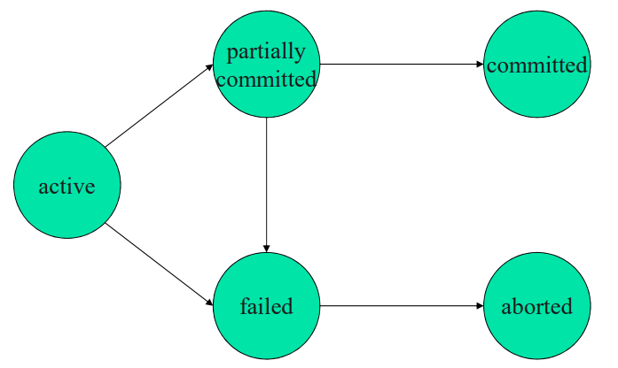
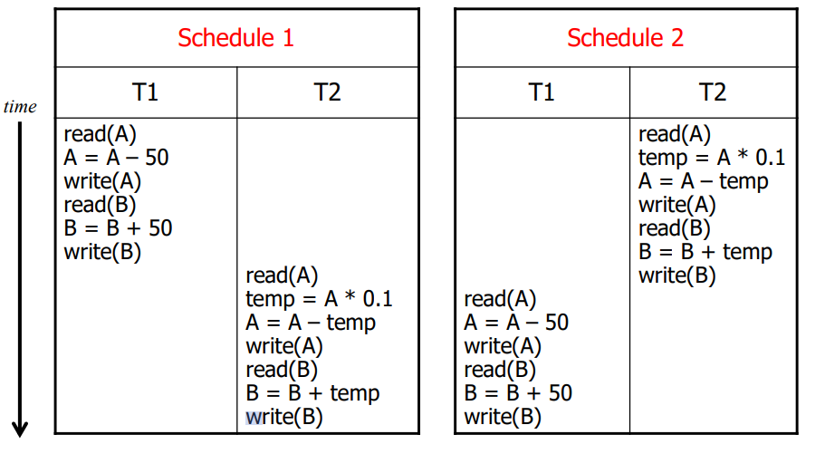
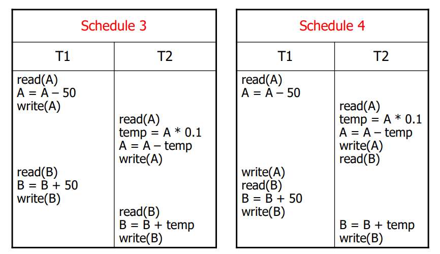
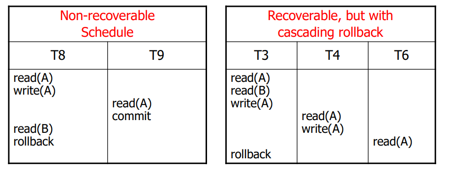

# Transaction
#데이터 베이스/Transaction

---
## Transaction의 개념
- 사용자 관점: 논리적인 작업의 단위
- 시스템 관점: 동시성 제어와 회복의 단위

Transaction의 속성
- Atomicity (원자성)
- Consistency (일관성)
- Isolation (고립성)
- Durability (영구성)

## Transaction STATE

## Concurrent Executions
Two Good Reasons for Allowing Contcurrency
- System Throughput 증가
    - CPU나 Disk의 이용률 증가에 기인
- Transaction의 Average Response Time 감소
    - FIFO vs Round Robin

Concurrency Control
- 동시에 실행되는 트랜잭션들의 실행 결과 정확성 보장
- Locking, Timestamp Ordering, Multi-version CC, ...

### Serial Schedule

### Concurrent Schedule

## Serializability
- S(c): Concurrenct schedule, SS: Set of serial schedules
- S(c)의 실행 결과가 SS의 한 schedule의 실행 결과와 동일할 때, S(c): Serializable Schedule

Serializability의 종류
- Conflict Serializability
- View Serializablility

### Conflict Serializability
Conflict Operaion
- Read vs Read (not conflict)
- Read vs Write (conflict)
- Write vs Read (conflict)
- Write vs Write (conflict)

Conflict Serializability
- Schedule S와 S'가 conflict equivalent
    - S의 nonconflict operation들을 swap하여 S'생성
- Concurrent schedule S가 conflict serializable
    - S와 conflict equivalent한 serial schedule 존재

Test for Conflict Serializability
- Schedule S에 대한 precedence graph가 cycle이 없을 경우
    - precedence graph: Schedule에 나타나는 트랜잭션들을 그래프로나타낸 것

## Recoverability
Recoverable & Cascadeless Schedule의 생성 방법
- Commit되지 않은 데이터에 대한 판독 금지

