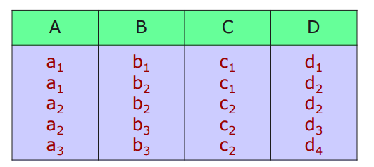

# 데이터 종속성과 정규화
#데이터베이스/데이터 종속성과 정규화

---
## 관계형 데이터베이스 설계의 문제점
잘못된 데이터베이스 설계의 문제점
- 정보의 중복
- 특정 정보를 나타낼 수 없음
    - 삽입 이상
    - 삭제 이상
    - 갱신 이상

## 분할
정보 중복 및 이상 현상을 해결하는 방법
- 릴레이션을 분할
- 잘못된 분할은 정보 손실(Information Loss) 초래

### 무손실 조인 분할
- 테이블 r1, r2, r3... 을 조인했을 때 R이 나오면 무손실 조인 분할, 만약 만족하지 않을 경우, 손실 조인 분할

## 함수 종속성
함수 종속성:A->B
- r의 임의의 두 레코드 t1과 t2에 대해 t1[A] = t2[A]이면 반드시 t1[B] = t2[B]일 경우, A->B 성립

- A -> C
- AB -> D

### 함수 종속성 집합의 Closure
함수 종속성 집합 F의 Closure: F+
- F에 의해 논리적으로 유도될 수 있는 모든 함수 종속성들의 집합
- 단순 종속성과 부분 종속성을 고려
    - 단순 종속성
        - 속성 A가 속성 B를 포함하면 A->B는 단순 종속성
    - 부분 종속성
        - A->B가 성립하며, r ⊂ A인 속성 r에 대해 r->B도 성립한다면, B는 A에 부분적으로 종속됨

### Armstrong의 원칙
기본 규칙
- 반사: A->B FOR B ⊂ A
- 첨가: If A->B and r ⊂ R, then rA -> rB
- 이행: If A->B and B->r, then a->r

추가 규칙
- 결합: If A->B and A->r, then A->Br
- 분할: If A->Br, then A->B and A->r
- 의사 이행: If A->B and rB->d, then Ar->d

### Canonical Cover
필요성
- 함수 종속성은 무결성 제한 조건
- DB의 변경이 발생할 때마다 FD의 유지 여부 검사
- Closure가 동일한 여러 개의 FD가 존재할 경우, 가급적이면 단순한 FD를 선택하여 구현

## 함수 종속성을 이용한 정규화

### 분할의 바람직한 속성
- 무손실 조인 분할
- 종속성 보전 분할

무손실 조인 분할 여부를 검사하는 방법
- R1과 R2를 R의 분할이라고 가정
- (R1 ∩ R2) -> R1 or (R1 ∩ R2) -> R2 이면 무손실 조인 분할

### 종속성 보전
정의
- F: 테이블 R에 대한 함수 종속성의 집합
- R1, R2..: R의 분할이라고 가정
- Fi: Ri에 포함돈 필드로만 구성된 함수 종속성의 집합
- F'= F1 ∪ F2 ∪ ...
- F'= F+이면 종속성 보전 분할

### 정규화
- 문제점이 있는 릴레이션을 분할하는 과정
- 단 정보 손실이 없도록(무손실 조인 분할, 종속선 보전 분할)