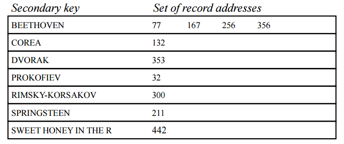

# 물리적 설계
#데이터 베이스/물리적 설계

---
## 데이터베이스의 물리적 설계
물리적 설계란?
- 논리적 스키마를 이용하여 효율적인 물리적 데이터베이스를 구성하는 일

물리적 데이터베이스의 구조
- 저장 레코드의 형식, 저장 순서, 접근 경로, 물리적 저장 장치의 할당등에 대한 내역

참고 사항
- 물리적 DB구조는 세부적인 성능에 영향을 미침
- 물리적 설계 단계에서 고려할 사항들의 대부분은 특정 DBMS에 의해서 해결됨
- DBA만이 물리적 DB 구조의 구성에 관여할 수 있음

## 파일 구성
파일 구성이란?
- 데이터베이스는 여러 개의 파일로 저장
- 파일은 여러 개의 레코드를 저장
- 레코드는 여러 개의 필드로 구성

고려 사항
- 레코드의 표현 방법(고정 vs 가변)
- 파일에서 레코드 저장 방법(순차 vs 클러스터링)

### 레코드의 표현 방법
고정 길이 레코드
- 모든 레코드의 길이를 동일하게 표현
- n이 레코드의 길이라고 할 때, i번째 레코드는 n*(i-1) 위치에 저장
- 블록의 경계를 넘어서는 레코드는 없도록 할 것.
- 장점: 구현이 용이

i번째 레코드가 삭제?
- 아래 레코들을 한칸씩 위로 이동
- 마지막 레코드를 i번째로 이동
- Free list로 연결
    - 파일 헤더에 첫번째 삭제 레도크의 위치를 저장
    - 각각의 삭제 레코드에 다음 삭제 레코드의 위치를 저장

가변 길이 레코드
- 필드의 순서는 고정
- 가변 필드 위치에(offset, length)의 고정된 정보만 저장하고 실제 데이터는 offset 위치에 저장
- Null-value bitmap: 속성당 1비트, Null 속성은 1로 set

### 파일에서 레코드 저장 방법
Heap 방식
- 파일 내에 임의의 위치(들어온 순서대로 저장)

순차 파일 구성
- 레코드를 키 순서대로 저장

해싱
- 키에 대한 해시 값을 레코드의 저장 위치로 결정

다중-테이블 클러스터링 파일 구성
- 여러 개의 릴레이션을 하나의 파일에 저장

## B 트리
속성
- 각 노드는 최대 m개의 포인터를 가질 수 있다.
- 루트와 리프를 제외한 모든 노드들은 적어도 m/2개의 child를 가져야 한다.
- 리프가 아닌 루트는 적어도 2개의 child를 가져야 한다.
- 모든 리프 노드들은 동일한 level에 위치한다.
- 리프가 아닌 노드가 k개의 child를 가질 경우, 그 노드는 k-1개의 key를 가져야 한다.
- 각 노드에서 key들은 순서대로 정렬되어야 한다.

### B*트리
B-Tree와의 차이점
- 한쪽의 sibling이 full될 때 까지 redistribution
- 루트를 제외한 모든노드들은 (2m-1)/3개의 pointer(child or data)를 가져야 한다.
- one-to-two split <-> two-to-three split

### B+트리
구조
- 인덱스 세트: 리프 노드가 아닌 노드들
    - 리프 노드까지의 액세스 경로를 제공
    - 데이터 주소 정보는 포함하지 않음
    - 특정 키 값을 갖는 레코드들을 액세스할 때 사용
- 순차 세트: 리프 노드
    - 데이터 주소 정보를  포함
    - 인접한 리프 노드간에 연결 리스트 구성
    - 순차 검색을 위해 사용

### B-Tree Family의 비교
- B-Tree Family가 항상 최선의 선택은 아니다
    - 구현 복잡
    - Index 크기가 작을 경우, simple index 가능
    - Random access가 주로 발생할 때, hashing 고려

- B-Tree Family의 공통점
    - Paged index structure
    - Maintain height-balanced trees
    - The trees grow from the bottom up
    - Greater storage efficeincy
    - Virtual tree structures 지원 가능
    - Variable-length record 지원 가능

## 보조 인덱스
(key, value) 쌍에서 value에 저장하는 값?
- 데이터 레코드의 주소
    - Simple & fast access
- 주 키
    - 안정성이 우수

중복 키의 저장 방법
- 역 인덱스 (Inverted Index)
- 다중 리스트 (Multi-list File)

### 역 인덱스
- 보조 인덱스를 array 구조로 구현
- 새로운 record 첨가 시, array에 포함 가능

### 다중 리스트 파일
- 보조 키에 대한 다중 리스트 인덱스 파일 + 데이터 파일(각 보조 키에 대한 link field 포함)

### 역 인덱스와 다중 리스트의 비교

-|역 인덱스|다중 리스트
---|---|---|
인덱스의 구성|가변 길이|고정 길이(인덱스 관리가 용이)
데이터 파일의 변경 여부|변경이 필요 없음| 변경 필요
검색 처리|경우에 따라 데이터 파일을 액세스 할 필요없음|대부분의 경우에 데이터 파일을 액세스하여야 함